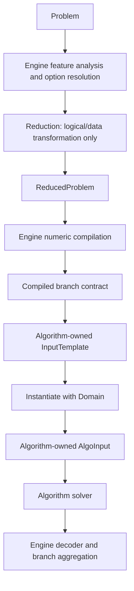

# WFOMC 模块归属与阶段边界审查

> 日期：2026-07-18
>
> 分支：`devel`
>
> 基线：`85abc33` 加当前未提交的 domain-separated refactor
>
> 状态：已实施；2026-07-20 完成 neutral stage contract 拆分

本文补充 ADR-0026，集中检查 `Problem`、feature analysis、reduction、engine、
algorithm input 和 runtime cache 的归属。目标不是引入新的抽象层，而是让现有
`compile -> instantiate -> solve` 流程中的每个对象只有一个明确阶段和权威来源。
第 2–9 节保留实施前的审查依据；第 10 节统一记录最终落地结果。

## 1. 总体结论

当前主方向正确：

- `Problem` 和 `Domain` 已经分离；
- engine 统一拥有 reduction 调用、数值编译、domain 实例化、decoder 和分支聚合；
- algo 只依赖中立 contract，不依赖 engine 或 reduction；
- reduction 不依赖 algo 或 engine；
- algorithm-owned `InputTemplate` 可以跨 domain size 复用。

现阶段没有必要增加 planner、通用 protocol 层或更多 wrapper。剩余问题主要来自
迁移过程中的三个模式：

1. 不同阶段靠同名属性进行 duck typing；
2. 为复用旧函数而传入假的 domain size 或假的 concrete instance；
3. cache 的声明所有者与对象的真实生命周期不一致。

依赖边界测试当前通过，但“没有反向 import”不等于阶段契约已经完全真实。

## 2. `FeatureSet` 的归属

### 决定

`FeatureSet` 不应成为 `Problem` 的 method 或 cached property。

它是 source problem 或 reduced branch 的派生能力描述，不是 source `Problem`
自身的权威状态。source 和 reduced branch 的 counting、cardinality、evidence
和 order feature 可能不同；`Problem.features()` 无法自然表达这种阶段差异。

当前最小、清楚的归属是：

| 内容 | 所有者 |
| --- | --- |
| `FeatureSet` 不可变数据 | 中立 contract：`wfomc.stages` |
| source/reduced feature 计算 | `wfomc.engine.features` |
| source feature cache | engine runtime/orchestration |
| 直接读取 evidence/constraints 的简单属性 | 对应的 problem-stage class |

`FeatureSet` 与 reduction/compilation 的其他中立阶段数据一起位于
`wfomc.stages`；`problem.py` 只定义用户输入问题和 domain，不承载派生阶段。

### 需要修正的接口

当前 `analyze_features` 声明接受 `Problem | ProblemInstance`，编译 reduced branch
时却传入 `CompiledBranchInstance`。这依赖以下人为补齐的属性：

- `Problem.has_profile_capacity_constraint -> False`
- `Problem.internal_weight_symbols -> ()`
- `CompiledBranchInstance.has_cardinality_constraints -> False`

建议改为两个显式入口：

```python
analyze_problem_features(problem: Problem) -> FeatureSet
analyze_reduced_features(problem: ReducedProblem) -> FeatureSet
```

随后删除只为 duck typing 存在的常量属性。`weights.py` 中的 symbol discovery
也应直接接受 `weights` 和 `internal_symbols`，而不是假定所有阶段都是 `Problem`：

```python
collect_symbolic_weight_variables(weights)
collect_output_weight_variables(weights, internal_symbols=())
```

## 3. 当前职责图



目标规则：

- reduction 只产生公式、raw weights、`DomainExpr`、marker specs 和 `DecoderSpec`；
- engine 才能选择 arithmetic backend 并产生 backend-native values；
- template 只保存跨 domain 可复用的算法结构；
- concrete input 只保存一次 solve 真正需要的 domain-sized 状态；
- cache 不能比其声明的 runtime/execution 生命周期更长。

## 4. 高优先级问题

### A1. Cardinality reduction 提前进行了数值编译

`reduction/reduced.py::_reduce_cardinality` 当前创建固定
`ArithmeticBackend.FMPQ_MPOLY` 的 `ArithmeticContext`，编译全部 weights，再把
marker 乘到 positive weight 上。之后 engine 又按用户选项编译一次 reduced
weights。

这造成：

- reduction 不再是纯逻辑/data transformation；
- 用户选择的 arithmetic backend 在 reduction 阶段尚未生效；
- `ReducedProblem.weights` 有时是 raw values，有时已经是 FLINT values；
- reduction 必须依赖 `arithmetic.py` 和 `compile_weight_mapping`；
- `collect_output_weight_variables(problem)` 继续依赖跨阶段 duck typing。

最小修改：

1. reduction 只分配 marker name、degree-limit `DomainExpr` 和 decoder spec；
2. 在 neutral reduced data 中记录 predicate-to-marker augmentation；
3. engine compilation 先选择 backend、编译 raw weights，再乘 marker；
4. decoder 仍由 reduction 定义语义，engine 负责实例化和调用。

不需要增加通用 reduction framework。

### A2. Counting reduction 仍使用假的 `domain_size=1`

`reduction/reduced.py::_reduce_counting` 为获得结构结果调用
`reduce_counting(..., domain_size=1)`，然后丢弃或覆盖其中的 domain-dependent
RHS 和 repeat factor，重新构造 `DomainExpr`。

`domain_size=1` 是旧 concrete reduction API 尚未真正 domain-free 的信号，也使
以后修改 `reduce_counting` 时容易意外使用错误常量。

建议让 counting helper 直接返回：

- formula patch；
- raw auxiliary weights；
- symbolic reduced cardinality constraints；
- symbolic repeat-factor expression。

删除 `domain_size`、`rational_cls` 和当前未被 wrapper 使用的 concrete
`repeat_factor`。

### A3. 实例方法上的无界 `lru_cache` 绕过 runtime cache 生命周期

以下缓存装饰在实例方法上：

- `cell_graph.data.Cell.get_evidences/is_positive`
- `algo.fast.graph._EvidenceOptimizedAnalysis.get_two_table_weight`
- `algo.fast.operations.MaterializedOptimizedEvidenceOperations` 的递归项

Python 的 function-level `lru_cache` 会把 `self` 保存在 cache key 中。因此：

- 临时 `_EvidenceOptimizedAnalysis` 在 template 构建结束后仍可能被永久引用；
- execution 从 bounded execution cache 淘汰后，operation object 仍可能存活；
- graph、arithmetic values 和递归结果也随之被保留。

这与 `RuntimeOptions.execution_cache_size` 的内存上限语义冲突。

建议将这些缓存改成对象拥有的普通 dict，随 template/execution 一起释放。
`Cell` 上的两个小查询可以预计算 predicate index，或使用有界/实例内缓存。

另外，`MultinomialCoefficients` 是 module-global 可变 Pascal table，并带两个
无界函数缓存。优先评估直接使用 `math.comb` 和纯 multinomial coefficient，
删除 `setup(n)` 全局阶段。固定大小的 algorithm spec registry cache 则可以保留。

### A4. Parser provenance 污染了逻辑 problem cache key

`parser.parse::_with_source_path` 把 `source_path` 写入 `Problem.options`，而
`Problem.cache_key_parts()` 包含全部 `options`。

同一个逻辑问题从两个路径加载时无法共享 feature/compile cache。`options` 这个
名字还会与 `AlgoOptions` 混淆。

建议：

- 把 `source_path` 放到 `ProblemInstance`，或删除未使用的 provenance；
- source path 不参与逻辑 cache key；
- 如果以后确有 problem metadata，显式区分 semantic metadata 和 provenance。

## 5. 中优先级问题

### B1. Template 构建通过假的 concrete input 绕行

`cell_graph/staging.build_structural_branch` 创建 domain 为空的
`CompiledBranchInstance`，而该 class 的文档声称它是 concrete branch。
Standard、Fast、Incremental、Incremental3 和 Recursive 随后调用
`build_input(...)` 先构造一个 concrete `AlgoInput`，最后只取 `.components`
生成 template。

Fast 还显式传入 `domain_size=0`。这与 counting reduction 的
`domain_size=1` 属于相同的 sentinel 模式。

建议不新增 class，只提取现有私有 component builder：

```text
compiled branch + structural profile
  -> build reusable components
  -> InputTemplate
  -> instantiate(actual concrete branch)
  -> AlgoInput
```

这样 `CompiledBranchInstance` 只表示真实 domain instance，template 构建也不再
需要仅用于构造中间 `AlgoInput` 的 `AlgoOptions` 或假的 domain size。

### B2. `AlgoInput` 保存 engine/registry metadata

base `AlgoInput` 当前保存：

- `algo: AlgoName | None`
- `options: AlgoOptions`
- `arithmetic: ArithmeticContext`

solver 只使用 `arithmetic`。lifted inputs 全部设置 `algo=None`；propositional 的
algo 值只有测试读取。resolved options 在 template build/instantiate 时可能有用，
但无需完整保存在 concrete input。

建议移除 `algo` 和 `options`。template builder 已经接收 resolved options，应只把
真正影响后续实例化的具体值存入 template。

### B3. 同一事实存在多个权威字段

- `CompiledReducedBranch.decoder_spec` 重复
  `CompiledReducedBranch.reduced_problem.decoder_spec`；
- `compile_problem` 已通过 runtime cache 获得 source `FeatureSet`，
  `compile_grounding_problem` 又直接调用 `analyze_features`；
- `CompiledProblem.feature_set` 和 direct `GroundingProblem.feature_set`
  保存的是同一个 source feature 概念。

Reduced branch 的 feature 确实需要独立保存，因为 reduced formula 已变化。
Direct source branch 至少应复用已经分析的对象，不应绕开 engine cache。

### B4. Runtime cache 只有 execution bucket 有上限

`results` 和 `algo_input_templates` 当前无界。result 本身通常较小，但 template
可能保存较大的 cell graphs；Incremental3 还可能随 domain size 产生多个 counting
state variants。

若 `RuntimeContext` 被长期用于批量问题或大量 domain size，execution cache 有界
并不足以限制总内存。建议先通过 benchmark 记录各 bucket 的实际增长，再决定：

- 为 results/templates 增加独立上限；或
- 提供明确的 bucket clear API；或
- 将 template cache scope 收窄到一个 compiled problem。

不建议在没有测量前引入复杂的通用 LRU 实现。

## 6. 低优先级归属和命名清理

### C1. 文件名与实际职责不一致

- `reduction/reduced.py` 不再定义 reduced types，主要是 apply pipeline；建议改为
  `reduction/apply.py`。
- cardinality marker encoding 和反向 result decoding 应共同位于
  `reduction/cardinality.py`。
- `engine/features.py` 只负责分析；结果类型定义在中立的 `stages.py`。

Decoder 的反向变换语义仍应归 reduction，engine 只负责调度，不必把 decoder
实现全部搬到 engine。

### C2. Public re-export 与真实所有者

- `wfomc.__init__` 直接从真实 owner 组合公共导出，不再经过额外
  API facade；
- `engine.__init__` 不应成为 `FeatureSet` 的内部导入路径；
- tests 也因此从多个不同入口导入同一个概念。

公共顶层 re-export 可以保留，但内部代码和测试应从真实 owner 导入：

- strategy enums：`wfomc.options`
- order encoding：`wfomc.fol.grounding`
- `FeatureSet`：`wfomc.stages`

### C3. 未使用或重复的 feature 字段

当前 production code 未读取：

- `FeatureSet.has_global_cardinality`
- `FeatureSet.requires_symbolic_weights`
- `FeatureSet.symbolic_weight_variables`

`named_constants` 主要用于测试，production 只读取 `has_named_constants`。
应确认它们是否属于公开诊断 API；否则删除，或将布尔值改成由 tuple 派生的 property。

`engine.features` 中基于 `"exists_"`/`"mod"` 字符串的 fallback 因 typed formula
遍历始终非空，当前也是不可达 legacy path。

### C4. `parse_input` 是含义模糊的 legacy alias

`parse_input = parse_problem_file` 没有 production 使用点，但仍作为顶层公共 API
导出。“input” 无法表达它只接受文件路径并返回 `ProblemInstance`。如果没有兼容性
承诺，建议删除；否则明确 deprecated，并统一内部测试使用 `parse_problem_file`。

## 7. 当前归属合理、无需移动的部分

- `engine/artifacts.py`：`CompiledProblem`、`ExecutionBranch`、
  `ProblemExecution` 属于 engine lifecycle。
- `options.py`：reduction 与 algo 共享的 strategy enum 放在中立根模块是合理的。
- `cell_graph/staging.py`：多个 cell-graph algorithm 的共享结构准备应留在
  `cell_graph`，不应移动到 engine；需要修正的是它制造 pseudo-concrete branch
  的接口。
- algorithm-specific component、template、input 和 solver 留在各自 `algo/*`。
- `cell_graph.data.CellGraphData` 作为共享 immutable graph output 的位置合理。
- `problem.py` 只承载 source/domain model；跨层 neutral stage contracts 位于
  `stages.py`，algo 和 reduction 无需反向依赖 engine。

## 8. 最小迁移顺序

### 第一批：修正阶段真实性

1. 拆分 source/reduced feature analysis。
2. 让 weight symbol discovery 接受 weights/internal symbols。
3. 将 cardinality marker 的数值应用移到 engine compilation。
4. 让 counting reduction 真正 domain-free。
5. 删除为 duck typing 和 sentinel domain size 服务的属性/参数。

### 第二批：修正 cache 生命周期

1. 将 instance-method `lru_cache` 改为 per-instance cache。
2. 用 stateless combinatorics 替代 global `MultinomialCoefficients.setup`。
3. 加入“execution 淘汰后对象可释放”的回归测试。
4. 测量 result/template bucket 后再决定容量选项。

### 第三批：简化 input/template

1. template 直接构建 reusable components，不先构造 concrete `AlgoInput`。
2. 删除 `AlgoInput.algo/options`。
3. 去掉重复 decoder/feature 字段和重复 feature 计算。

### 第四批：命名和 public surface

1. 移动 parser provenance。
2. 重命名 reduction 文件。
3. 统一 internal/test imports 到真实 owner。
4. 删除 dead FeatureSet fields、字符串 fallback 和无兼容需求的 alias。

最终采用了最小的两模块拆分：

```text
problem.py   -> Problem, Domain, ProblemInstance
stages.py    -> FeatureSet, ReducedProblem, decoder specs,
                GroundingProblem, compiled branch contracts
```

不要引入泛化的 `contracts.py`、planner 层或只转发调用的 wrapper。

## 9. 风险与验证

这些调整触及 cardinality weights、counting correction、cache lifetime 和多 domain
复用，实施时至少需要：

- 所有算法与 propositional oracle 的 small-domain exact-result parity；
- cardinality marker 的 `fmpq_mpoly` / 显式 `fmpq_poly` backend matrix；
- 同一 compilation 在多个 domain size 上的结果和 template reuse 测试；
- unary evidence open/closed structural variant 测试；
- execution eviction 后的 weak-reference/GC 生命周期测试；
- dependency-boundary AST test；
- 完整 benchmark 的 compile-once/multi-domain 性能对比。

## 10. 实施结果

四批迁移均已落地：

1. **阶段真实性**
   - source/reduced feature analysis 改成两个显式入口；
   - weight symbol discovery 直接接收 weight mapping；
   - cardinality marker 的 backend-native 乘法移到 engine compilation；
   - counting reduction 只产生 raw weights、`DomainExpr` constraints 和
     symbolic repeat factor，不再传入假的 `domain_size=1`；
   - 删除为跨阶段 duck typing 补出的常量属性。
2. **Cache 生命周期**
   - Fast evidence operation 改用对象拥有的 dict cache；
   - 删除 instance-method 无界 `lru_cache`；
   - 全局可变 multinomial table 改成基于 `math.comb` 的纯函数；
   - input-template、execution 和 result bucket 都有独立容量上限；
   - weak-reference 回归测试证明 execution 淘汰后 operation 可回收。
3. **Input/template 边界**
   - cell-graph template 直接构建 reusable components，不再制造假的
     `CompiledBranchInstance` 或中间 `AlgoInput`；
   - `AlgoInput` 只保留 solver 真正共享的 arithmetic context；
   - resolved propositional options 存在 template，而不是每个 concrete input；
   - 删除重复 decoder 字段，并复用 cached source `FeatureSet`。
4. **命名和 public surface**
   - provenance 移到 `ProblemInstance.source_path`，不进入逻辑 cache key；
   - `reduction/reduced.py` 改为 `reduction/apply.py`；
   - cardinality marker encoding 与 decoder 统一归
     `reduction/cardinality.py`；
   - strategy、order encoding 和中立阶段类型的内部/test imports 指向真实 owner；
   - 删除无调用方的 `FeatureSet` 字段、legacy string fallback、
     existential `rational_cls` 参数和 `parse_input` public alias。
5. **Neutral contract 拆分**
   - `problem.py` 只保留 `Problem`、`Domain`、`ProblemInstance`；
   - `stages.py` 统一承载 `FeatureSet`、reduction data、`GroundingProblem`
     以及 compiled/concrete branch data；
   - direct propositional input 显式持有 `grounding_problem`，不再以含混的
     `compiled` 字段表示 source-grounding 阶段；
   - dependency-boundary test 同时约束 `problem.py`、`stages.py` 和
     `options.py` 不得依赖 engine、algo 或 reduction。
6. **Reduction pipeline 收敛**
   - `apply.py` 只保留 normalization 和显式 pass 编排；
   - unary evidence、counting、existentials 和 cardinality 各自拥有完整的
     `ReducedProblem -> ReducedProblem` pass；
   - `reduce_problem` 返回单个 `ReducedProblem`，删除已经不产生多分支的 tuple
     contract；
   - `wfomc.reduction` 只导出 `reduce_problem`，stage data 从真实 owner
     `wfomc.stages` 导入；
   - 删除重复 branch applicability 检查和未使用的 `max_domain_size`。
7. **InputTemplate nominal contract**
   - `ReducedInputTemplate` 明确接收 `CompiledBranchInstance`；
   - `GroundingInputTemplate` 明确接收 `Domain`；
   - 所有实际 algorithm template 必须继承其中一个 nominal base；
   - `AlgoSpec.build_input_template` 返回 `AlgoInputTemplate`，structural cache key
     收窄为 `Hashable`；
   - engine 以 branch/template 的显式 `isinstance` 配对后直接调用
     `instantiate()`，不再通过 `getattr`/`callable` 猜测接口。

最终依赖方向保持：

```text
algo      -> neutral problem/stages/options contracts
reduction -> neutral problem/stages/options contracts
engine    -> algo + reduction + neutral contracts
```

没有新增 planner、通用 stage protocol 或转发 wrapper。

### 最终验证

- 全量测试：`566 passed, 5 skipped`；
- 静态检查：`ruff check src tests benchmarks` 通过；
- 构建：sdist 和 wheel 均成功；
- CLI：`wfomc --help` 与 `fastv2` model smoke 通过；
- 依赖边界与 provenance/public-API 定向测试：通过；
- bounded benchmark smoke：4 个 core cases × `fastv2`/`incremental3` 共 8
  次当前分支运行全部成功，算法间结果一致；每次限制 30 秒、4 GiB RSS，
  峰值 38.6–50.8 MiB；
- 与迁移前已保存 smoke rows 相比，这 8 次运行没有状态、结果、时间或内存回归；
- compile-once probe：两个算法分别只发生 1 次 compilation miss、1 次
  input-template miss；后续 domain size 4/8 各命中同一 template，结果与 cold
  solve 完全一致。
