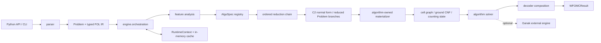
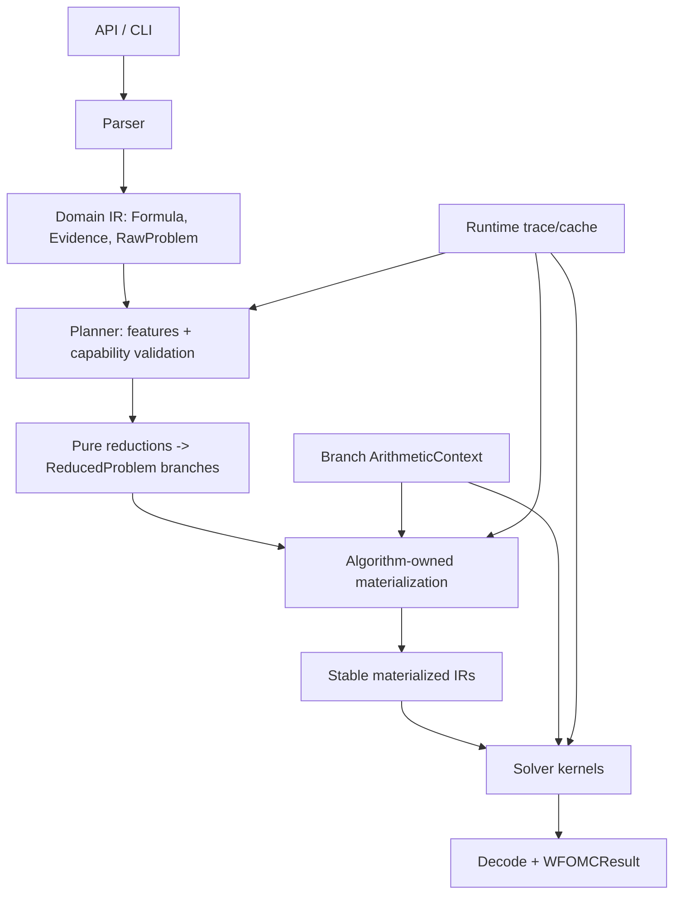

# WFOMC 当前架构评审

> 评审日期：2026-07-10
> 基线：`codex/modk-framework`，HEAD `d061a02`
> 评审对象：当前工作区（包含尚未提交的大规模迁移），不是仅评审 HEAD 版本。

> 实施更新：本评审推动的第一轮简化已经落地。Binary evidence 与未贯通的
> rounded arithmetic 现在 fail-fast；稳定 CLI 已修复；算法主链已收敛为
> `compile -> input template -> instantiate -> solve -> decode`；共享
> cell-graph adapter 已删除，算法消费 `CellGraphData` 或自己的派生表。
> Problem、Domain、ReducedProblem、CompiledProblem 和 ProblemExecution 的
> 阶段边界也已落地，旧 NormalFormReductionView 已删除。Evidence 也已收敛为
> raw model、profile-capacity reduction artifact 和 cell allocation 三个阶段。
> 详见 ADR-0013 和 ADR-0026。

## 1. 结论摘要

当前仓库正在从旧式、算法耦合的实现迁移到一个**注册表驱动的 Python 模块化单体**。主干方向是合理的：`Problem`、特征分析、纯 reduction、算法物化和求解已经形成了一条可辨识的流水线；每个算法通过 `AlgoSpec` 声明能力与处理链，避免了 engine 中不断增长的算法条件分支。

不过，当前状态仍是“迁移中的框架”，还不能视为稳定的公共库。最需要关注的不是是否拆成微服务，而是**契约是否真实、边界是否闭合、用户入口是否可用**。

综合判断：

- 架构形态选择正确：继续保持模块化单体，不需要微服务化。
- 核心编排方向正确：engine 已接近纯调度器，算法注册机制具有扩展性。
- 当前有两个 P0 问题：二元 evidence 被静默忽略；默认 `wfomc` CLI 入口已失效。
- 算术后端、类型边界、依赖方向仍未完成收敛；计划文档中的目标和实际代码有明显差距。
- 测试覆盖当前主路径较好（201 项通过），但 CI 只跑测试，不检查 lint、CLI、README 示例、wheel 安装和架构依赖，因此没有拦住上述故障。

建议先完成“正确性与公开契约收口”，再做内部模块拆分和性能优化。

## 2. 系统定位与约束

这是一个本地运行的科学计算/组合计数 Python 库及 CLI，不是在线服务。它解析 FO²/C²/MLN 输入，将其归一化和约简，再分派给 lifted、递归、增量或命题化计数算法，返回精确或近似算术结果。

从仓库可推断出的约束：

- Python 3.11+，单进程、内存内执行。
- 主要计算依赖 FLINT、PySAT、pynauty、NetworkX；命题化后端可调用外部 Ganak。
- 核心价值是计数正确性和多算法可比性，性能次之，API/CLI 稳定性再次之。
- 当前没有明确的吞吐、延迟、最大域大小、内存上限、RPO/RTO 或兼容性承诺；因此本报告不虚构数值型 SLO。

## 3. 当前高层架构



主流程由 `src/wfomc/engine/orchestration.py` 实现：

1. `analyze_problem` 生成 `FeatureSet`。
2. `algo_spec` 从注册表加载算法规格。
3. 算法规格解析选项并校验能力。
4. engine 按顺序应用算法声明的 reduction。
5. 每个 reduced branch 由算法自己的 materializer 转成 `AlgoInput`。
6. solver 返回 `WFOMCResult`，engine 组合 decoder 并汇总分支。

这种结构本质上是“pipeline + strategy/plugin registry”。对当前规模和团队形态，它比微服务或事件驱动架构更合适：无需引入网络、序列化、一致性和部署复杂度。

## 4. 模块职责与实际边界

| 模块 | 当前职责 | 评审 |
| --- | --- | --- |
| `api.py` / `cli.py` | 公共调用入口 | facade 简洁，但与 README、console script 未收敛 |
| `parser/` | WFOMCS/MLN 到 `Problem` | 边界清楚 |
| `fol/` | typed FOL IR、分析、重写、语义、grounding | 基础域层，但 grounding 反向依赖 `cell_graph` |
| `normal_form/` | C² 归一化与校验 | 职责合理，单文件复杂度偏高 |
| `engine/` | 特征分析、编排、运行时缓存 | 已接近纯调度；缓存和可观测性较弱 |
| `reduction/` | 纯问题变换及 decoder 组合 | 方向正确；仍大量使用 `object`，契约约束不足 |
| `algo/` | 算法规格、输入物化、求解 kernel | 注册方式好；共享 cell-graph 适配层知道过多具体算法类型 |
| `cell_graph/` | cell graph 构建与权重操作 | 核心计算热点，也是最大的复杂度集中区 |
| `evidence/` | raw evidence 输入与 profile-capacity 数据 | 阶段边界已收敛；二元 evidence 尚未接入执行语义 |
| `arithmetic.py` / `weights.py` / `cardinality_constraints.py` | 算术后端、权重编译与基数约束模型 | ArithmeticContext 已按 reduced branch 贯穿算法执行；基数约束在 reduction 中直接改写权重 |

原评审中的 `evidence/unary.py` 上帝模块现已删除；剩余复杂度主要集中在
normal-form normalization 与 cell-graph 构造。

## 5. 做得好的地方

### 5.1 Engine 不再按算法硬编码分支

`AlgoSpec` 把名称、option resolver、reduction 链、materializer 和 solver 组合在一起。新增算法通常只需新增 spec 和实现模块，不必修改编排主流程。动态 import 还避免了启动时导入全部算法实现。

### 5.2 Reduction 支持可复用分支与数据化 decoder

`reduce_problem` 产生一个或多个 domain-free `ReducedProblem`。每个分支用
`DecoderSpec` 记录修正步骤，engine 在具体 domain 上实例化 decoder 后统一求解、
解码和求和，算法不需要重复处理计数修正因子。

### 5.3 Runtime cache 是实例级而非全局状态

只有复用同一个 `RuntimeContext` 才会复用缓存，测试和调用之间不会天然互相污染。这比模块级缓存更安全，也方便做基准对比。

### 5.4 测试对当前主路径有实际保护

当前工作区执行 `uv run pytest -q` 得到 **201 passed**。算法规格均可加载，wheel 也可成功构建。这说明迁移后的核心路径不是纯脚手架，已经有可运行基础。

## 6. 架构问题与优先级

### P0-1：`Problem` 接受二元 evidence，但执行管线静默忽略它

证据：

- `evidence/core.py` 定义并公开 `GroundBinaryLiteral`、`BinaryEvidence` 和 `Evidence.binary`。
- `Problem.has_binary_evidence` 明确认可这个能力。
- `FeatureSet` 只有 `has_unary_evidence`，没有 binary evidence 特征。
- production 路径中没有把 `Problem.evidence.binary` 转成 reduction、ground units 或算法输入；代码里对 `has_binary_evidence` 的唯一读取就是属性定义本身。

最小复现：域 `{a,b}` 上恒真的二元谓词 `R` 原计数为 16；加入证据 `R(a,b)=true` 后，standard 算法仍返回 16，正确结果应为 8。

影响：这是静默错误，不是显式“不支持”。对计数库而言属于最高级别风险，因为调用成功但结果错误。

建议：

1. 在 binary evidence 完整接入前，在 feature analysis/option validation 最早阶段统一抛 `UnsupportedFeatureError`。
2. 为每个算法显式声明支持的 evidence kinds，而不只声明 unary strategy。
3. 增加跨算法契约测试：同一个二元 ground literal 必须改变计数，或算法必须明确拒绝。
4. 后续再实现 `Problem.evidence -> EvidenceConstraints/GroundEvidenceInput` 的统一路径。

### P0-2：默认 CLI 和 README 公共 API 已失效

证据：

- `pyproject.toml` 把主命令 `wfomc` 指向已不存在的 `wfomc.solver:main`。
- 实测 `uv run wfomc --help` 抛 `ModuleNotFoundError: No module named 'wfomc.solver'`。
- 可工作的命令是仍标记为 experimental 的 `new_wfomc`。
- README 首选命令仍是 `uv run wfomc ...`，Python 示例导入 `Algo`、`Const`、`Pred`、`WFOMCProblem`、`fol_parse`、`to_sc2`、`wfomc`；当前顶层包不导出这些符号，示例第一行即 `ImportError`。
- `algo/__init__.py` 又保留了第二套 `Algo` enum，但 engine 公共入口严格要求 `AlgoName`，形成双重命名。

影响：安装成功不等于产品可用；新用户会在第一条命令和第一段示例处失败。发布 wheel 也不会发现 console script 指向不存在模块。

建议：只保留一个稳定 CLI 名称和一个算法 enum。把 `wfomc` 指向 `wfomc.cli:main`，删除或显式弃用 `new_wfomc`；同步重写 README，并在 CI 中安装 wheel 后执行 CLI/README smoke test。

### P1-1：算术后端只影响权重编译，没有贯穿求解过程

架构计划要求“参与 WFOMC 运算的每个值都由 `ArithmeticContext` 创建”，但当前：

- `AlgoInput` 及具体输入类型不携带 arithmetic context。
- `arithmetic_for_branch` 已定义但没有调用点。
- solver、cell graph、cardinality 和 counting kernel 中仍大量直接创建 `fmpq`/`Rational` 的 0、1 和中间值。
- standard solver 明确用 `Rational(0,1)` 初始化，并用 Python 整数 `1` 计算配置权重。

实测同一简单问题：`round/arb` 可以返回结果，而 `round/float` 在求解阶段因 `float *= fmpq` 抛 `TypeError`。这说明 public `WeightOptions` 暴露了未端到端成立的能力。

影响：不同后端行为不一致；某些组合在编译成功后才运行时失败，也可能发生隐式类型提升，破坏用户选择的精度/性能语义。

建议：将 branch-local `ArithmeticContext` 放进所有 `AlgoInput`，并逐算法禁止直接构造数值；完成前应把未支持的 rounded backend 在 option resolution 阶段明确拒绝。

**2026-07-10 实施更新：已解决。** 每个最终 `PreparedBranch` 在逻辑 reduction
后根据自己的 solver symbols 创建一个 `ArithmeticContext`；对应的
`CompiledProblem`、`AlgoInput`、cell graph、solver kernel 和 decoder 共享同一
实例。不同 branch 和算法可以拥有不同 backend/symbol 集。standard、fast、
fastv2、incremental、incremental3、recursive 已通过 float/arb scalar 以及
单 symbol arb polynomial 的端到端矩阵。rounded cardinality 因 python-flint
没有 `arb_mpoly` 而提前拒绝，propositional Ganak adapter 继续明确限制为 exact。

### P1-2：核心契约的类型和运行时表示不一致

典型例子：

- `Problem.weights` 声明为 `Mapping`，但 `compile_reduced_problem_weights` 返回的 `Problem.weights` 实际是排序后的 tuple。
- 部分 input-template builder 参数和外部 solver payload 仍使用 `object`。
- `RuntimeContext.from_runtime` 接受任意对象，并通过 `__getattr__` 动态透传。
- 多个输入 dataclass 同时保存 `components` 和从首个 component 复制出来的 `cells`、`weights` 等镜像字段。

影响：类型检查无法捕获真实接口错误；迁移期兼容代码会长期固化。数据镜像还会带来“不知道哪个字段是权威来源”的一致性风险。

建议：明确引入 `RawProblem -> ReducedProblem -> MaterializedProblem/AlgoInput` 三种不同类型，不再用同一个 `Problem` 承载 raw mapping 和 compiled tuple。删除首 component 镜像字段，或把它们改成只读 property。

**2026-07-10 实施更新：部分解决。** 当前已用 `Problem -> ReducedProblem ->
CompiledProblem -> AlgoInput` 区分阶段，reduction 结果、spec compilation、
input builder 和 cache helper 都改为具体契约；
`RuntimeContext` 也只接受 `RuntimeOptions`，不再透传任意对象。剩余 `object`
主要表示公式节点、谓词、FLINT ring element、cache key 和外部 engine payload，
不是问题阶段边界。数值类型进一步统一仍属于 P1-1 的后续工作。

**2026-07-10 数值模块更新：已解决。** 根目录数值接口现在固定为：
`arithmetic.py` 拥有 `ArithmeticBackend`、`ArithmeticValue`、backend 选择和
`ArithmeticContext`；`weights.py` 只拥有 `WeightOptions`、weight mapping、
symbol 收集和 context 驱动的编译；`result.py` 只负责公开结果读取。
`WeightPlan`、自定义 `Rational`、`utils/polynomial_flint.py` 均已删除；唯一保留的
组合数能力直接位于根目录 `multinomial.py`，不再为单文件保留 `utils` 包。模块
`__all__` 和依赖方向由结构测试保护。

### P1-3：基础域层出现反向依赖，共享 materializer 知道所有算法

当前存在两个明显的依赖方向问题：

- `fol/grounding.py` 为复用 `qf_ground_on_tuple`、`qf_preds`，反向 import `cell_graph.formula_ops`。应当是 cell graph 依赖 FOL 基础能力，而不是 FOL 依赖高层图实现。
- `algo/cell_graph/components.py` 和 `inputs.py` 直接 import fast、incremental、incremental3、propositional 等具体输入类型。共享层每新增一种 cell-graph 算法都需要修改，违反开放封闭原则。

影响：容易形成循环依赖，因此代码大量使用局部 import 和 `TYPE_CHECKING` 绕开初始化问题；模块无法独立测试或复用。

建议：

- 把纯公式 grounding 操作下沉到 `fol`，让 `cell_graph.formula_ops` 只保留图领域适配。
- 把每种具体 component/input 的构造函数移回对应算法包，共享层只输出一个稳定的 `MaterializedCellGraph` 数据结构。
- 增加 import-linter 或自定义 AST 结构测试，固定允许的依赖方向。

**2026-07-11 更新：已解决。** `cell_graph` 现在直接依赖 `fol`，旧
`formula_ops.py` 已删除；共享输出固定为 `CellGraphData`。算法 component 构造
仍由各算法 input 模块负责，并由结构测试禁止 cell-graph 反向依赖
problem、engine 或 algo；只有显式的 `cell_graph/evidence.py` 可以依赖 reduced
evidence contract。

**2026-07-11 算法包更新：已解决。** 所有自有实现统一为
`input.build_input`、`solve.solve`、`spec.SPEC`；package `__init__.py` 不再维护
lazy forwarding。treewidth 数据契约也已从 `solve.py` 移回 `input.py`。
fastv2 明确作为配置变体复用 fast，避免为形式一致新增空 wrapper。

### P1-4：复杂度集中在少数“上帝模块”

`cell_graph/cell_graph.py` 同时负责：公式 grounding、model 枚举、cell/two-table 构造、order predicate、optimized graph、evidence profile 扩展和构建入口。`evidence/unary.py` 同时负责输入组织、profile、分配、系数和 CCS 编码。

影响：任何 evidence、order 或算术改动都会跨越同一大文件；单元测试虽多，但局部重构成本和回归面持续扩大。

建议按稳定概念拆分，而不是按行数机械拆分：

- `cell_graph/model_enumeration.py`
- `cell_graph/base.py`
- `cell_graph/order_tables.py`
- `cell_graph/optimized.py`
- `evidence/data.py` 与 `evidence/profile.py`
- `reduction/reduce_unary_evidence.py`
- `cell_graph/evidence.py`

拆分前先建立等价性/性质测试，避免在算法迁移和结构拆分同时改变行为。

**2026-07-11 cell graph 更新：已解决。** 原 `cell_graph.py` 已收敛为
`build.py` 与 `data.py`：builder 为单次使用的内部对象，唯一共享输出是
`CellGraphData`。fast/fastv2 对该数据做组合式 clique analysis，不再继承 live
builder。全局 cell-graph cache、`formula_ops.py`、单函数 `utils.py`、重复
`nullary_weights` 和 test-only data facade 均已删除。

**2026-07-12 cell graph correctness 更新：已解决。** `build_cell_graphs` 在
nullary branching 前冻结原始 predicate universe，并在每个 diagonal/pair local
model 中显式保留这些 atoms。删除了将“全部 predicate 为 unary”误判成 pair
independence 的 shortcut；small-domain tests 会将 standard 结果与 propositional
grounding 对照。standard 的空域 zero-configuration 路径也已补齐。
同时修复了 `qf_formula or true()` 将显式 `false` 当成缺失公式的问题，以及
`MultinomialCoefficients.setup(0)` 未初始化的问题。

**2026-07-10 evidence 更新：已解决。** `evidence/unary.py` 已删除：raw 输入位于
`evidence/data.py`，唯一 reduced profile 表示位于 `evidence/profile.py`，CCS
构造归 reduction，cell compatibility 与 multinomial DP 归
`cell_graph/evidence.py`。`EvidencePartition`、`UnaryEvidencePartition` 和
相互转换函数均已删除；`EvidenceStrategy` 归 `algo/core.py`。

### P1-5：可运行能力、实验扩展点和 CLI 选项没有分级

registry 和 CLI 曾同时暴露尚不可运行的扩展点：

- bounded-treewidth 的 reduction 无条件抛“not yet implemented”。
- README 只描述其中一部分算法，且默认算法描述与 CLI 默认值不一致。

影响：注册成功被误解为“用户可用”。用户只能通过运行失败来发现成熟度和前置条件。

建议在 `AlgoSpec` 增加 `status`、`requirements`、`capabilities`，CLI 默认只列 stable/beta，实验算法通过 `--include-experimental` 或独立子命令展示。

**2026-07-10 实施更新：本项要求已解决。** `AlgoSpec` 已增加
`AlgoMaturity` 和 `external_requirements`；CLI choices 由 registry 生成，只显示
stable/beta。bounded-treewidth 标为 unavailable，Python API 仍保留这个扩展点。
更完整的 feature capability matrix 仍由 P0-2 跟踪。

### P1-6：文档、benchmark 与代码迁移不同步

当前 `docs/README.md` 链接的五份“Current Architecture”文档都已在工作区删除。`benchmarks/run_framework_benchmarks.py` 仍 import 已删除的 `wfomc.framework.benchmark`；`benchmarks/README.md` 也指向该模块。

影响：缺少可信的性能回归机制，架构文档也无法作为新成员的事实来源。迁移计划很多，但“当前状态”文档反而失效。

建议把本报告作为新的当前状态入口；修复或删除失效 benchmark；计划文档应明确 `proposed/in-progress/done/superseded`，完成后将结论沉淀为 ADR，而不是继续把 plan 当架构说明。

### P1-7：CI 只跑 pytest，无法保护发布契约

当前 workflow 名称声称运行 tests and lint，但实际只有 `uv run pytest tests`。本地 `ruff check` 当前报告 25 个问题，其中包括失效 benchmark 名称、未定义类型名和未使用迁移代码。CI 也没有：

- lint/type check；
- wheel 安装验证；
- `wfomc --help` 和最小模型 smoke test；
- README 示例验证；
- benchmark import smoke test；
- 架构依赖规则。

影响：201 个测试全部通过，仍可交付一个默认命令不可运行、部分输入被静默忽略的包。

### P2-1：Runtime cache 没有容量、并发和失效策略

缓存按 runtime 实例隔离是优点，但四个 bucket 都是无界 dict；`get_or_build` 没有并发保护，同一 key 在多线程下可重复构建；key 通过 `repr`/`str` 混合序列化，缺少版本化的领域 fingerprint 契约。

对当前单次 CLI 运行问题不大，但长生命周期 notebook、服务封装或大规模 benchmark 会持续占用内存。建议先记录最大规模与命中率，再决定 LRU/容量限制；不要为了假设规模立即引入 Redis 或分布式缓存。

### P2-2：可观测性选项是空契约

`RuntimeOptions` 暴露 `debug`、`profile`，但 production 路径没有读取它们。已有 Loguru debug 日志也不会由这些选项启用。用户以为开启了诊断，实际没有行为变化。

建议要么接通阶段耗时、cache stats、算法选择和 reduction trace，要么暂时删除这两个选项。

## 7. 非功能需求评审

| 维度 | 当前状态 | 风险 | 建议 |
| --- | --- | --- | --- |
| 正确性 | 主路径测试较多；binary evidence 静默错误 | 极高 | 建立 feature × algo 契约测试和跨算法 oracle |
| 性能 | 算法与 cell graph 有专门优化；主 benchmark 已失效 | 高 | 先恢复可重复 benchmark，再优化热点 |
| 可扩展性 | AlgoSpec 易扩展；共享层耦合具体算法 | 中 | 稳定 materialized IR，算法包自有构造 |
| 可靠性 | 失败多为异常；部分未支持能力静默通过 | 高 | fail-fast，统一 UnsupportedFeatureError |
| 可维护性 | 模块化方向正确；大文件和 `object` 边界较多 | 高 | 分阶段收敛类型、依赖和职责 |
| 可观测性 | 有日志和 cache stats 雏形 | 中 | 接通 RuntimeOptions 和阶段 trace |
| 安全性 | 本地库，攻击面较小；可执行外部 Ganak | 中低 | 校验二进制路径、记录版本、限制不可信输入资源消耗 |
| 运维/发布 | wheel 可构建；默认 CLI 与文档失效 | 高 | 增加安装后 smoke test 和 release checklist |
| 成本 | 无服务基础设施成本；主要是开发维护和计算资源 | 中 | 避免微服务化，优先降低迁移与回归成本 |

## 8. 主要故障模式

| 故障 | 当前表现 | 期望策略 |
| --- | --- | --- |
| 输入包含二元 evidence | 成功返回错误计数 | 立即拒绝，或按算法正确物化 |
| 用户运行默认 CLI | import 阶段崩溃 | CI 阻断发布 |
| 选择未贯通的 arithmetic backend | 运行中类型错误 | option resolution 阶段 fail-fast |
| Ganak 未安装/路径错误 | 命题算法失败 | 保持明确异常，并在 capability 中标出外部依赖 |
| bounded-treewidth 被选择 | reduction 阶段必然失败 | 不出现在默认可用算法列表 |
| 长生命周期 context 处理很多问题 | cache 无界增长 | 容量/清理策略和指标 |
| benchmark/文档漂移 | 无法验证性能与使用方式 | 文档/benchmark smoke test |

## 9. 建议的目标架构

不改变模块化单体形态，只收紧内部层次：



依赖规则：

1. `fol`、`evidence`、`weights` 等 domain 层不得 import `cell_graph`、`algo`、`engine`。
2. `reduction` 可依赖 domain/normal-form，但不得依赖具体算法。
3. engine 只依赖 `AlgoSpec` 契约，不依赖具体 solver。
4. 共享 materialized IR 不 import 具体算法输入；具体算法可依赖共享 IR。
5. 每个 public feature 必须满足“所有算法明确支持或明确拒绝”。

## 10. 推荐实施顺序

### 阶段 0：立即止血

1. 对 binary evidence fail-fast，并增加正确性回归测试。
2. 修复 `wfomc` console script，统一 `AlgoName`/`Algo`，更新 README 示例。
3. 对尚未贯通的 arithmetic backend fail-fast。
4. 从默认 CLI choices 隐藏必然失败的 bounded-treewidth。

### 阶段 1：建立迁移护栏

1. CI 增加 ruff、wheel install、CLI、README、benchmark import smoke test。
2. 增加 feature × algo capability matrix 测试。
3. 增加依赖方向测试。
4. 恢复最小、扩展、外部后端三层 benchmark。

### 阶段 2：收敛核心契约

1. 引入不同类型的 `RawProblem`、`ReducedProblem`、materialized IR。
2. 将 `ArithmeticContext` 贯穿 materializer、cell graph 和 solver。
3. 删除 `AlgoInput` 的镜像字段与无效 runtime options。
4. 完成 `EvidenceConstraints` 聚合，移除 `Problem.profile_capacity_constraint` 过渡字段。

### 阶段 3：降低模块复杂度

1. 将纯 grounding 能力下沉到 `fol`。
2. cell graph 与 unary evidence 上帝模块均已完成拆分。
3. 将算法特定 input/component 构造移回算法包。
4. 对 cache 增加容量和观测，但只在真实长生命周期场景需要时实施。

## 11. ADR 建议

### ADR-A：保持模块化单体

- **状态**：建议接受。
- **决策**：继续使用单 Python package + algorithm registry，不拆微服务。
- **理由**：算法共享同一 FOL、normal form、cell graph 和算术对象；进程内调用能避免序列化和分布式一致性成本。
- **代价**：必须用依赖规则和稳定 IR 管理模块边界。
- **备选方案**：微服务；因没有独立部署、团队自治或独立扩缩容需求而拒绝。

### ADR-B：能力声明必须成为 AlgoSpec 的一等字段

- **状态**：建议接受。
- **决策**：`AlgoSpec` 显式声明 maturity、evidence kinds、counting/order 支持、external requirements 和 arithmetic backends。
- **理由**：当前 capability 分散在 option resolver、solver 异常、README 和隐含行为中，已经造成静默错误和伪可用选项。
- **代价**：每个算法都需维护能力表，并增加矩阵测试。
- **备选方案**：继续依赖运行时异常；因无法防止静默忽略而拒绝。

### ADR-C：Raw、Reduced、Materialized 使用不同数据类型

- **状态**：建议接受。
- **决策**：不再复用 `Problem` 表达 raw weights 和 compiled weights，也不再以大量 `object` 字段承载阶段差异。
- **理由**：让非法状态不可表示，类型检查才能保护迁移。
- **代价**：短期需要迁移 materializer 和测试 fixture。
- **备选方案**：继续在 `Problem` 上 `replace`；短期改动小，但会长期保留表示漂移。

### ADR-D：ArithmeticContext 是 branch 级强制依赖

- **状态**：建议接受。
- **决策**：每个 materialized branch 恰有一个 context，所有 solver 中间值由它创建。
- **理由**：这是让 `WeightOptions` 语义端到端成立的唯一可靠方式。
- **代价**：需要逐算法改造，不能一次性机械替换。
- **备选方案**：只编译输入权重；已由 `round/float` 运行时失败证明不足。

## 12. 验证记录

本次评审实际执行：

```text
uv run pytest -q
=> 201 passed in 3.13s

uv run ruff check src tests benchmarks
=> 25 errors

uv run wfomc --help
=> ModuleNotFoundError: No module named 'wfomc.solver'

uv run new_wfomc --help
=> 成功

uv build
=> sdist 和 wheel 构建成功

README Python API import
=> ImportError: cannot import name 'Algo' from 'wfomc'

binary evidence 最小计数复现
=> 无 evidence: 16；R(a,b)=true: 16（预期 8）

rounded backend 最小复现
=> arb: 成功；float: TypeError (float *= fmpq)
```

这些结果说明：测试通过和 wheel 构建成功并不足以证明公共产品契约可用，下一轮架构工作应优先补齐端到端契约测试。
