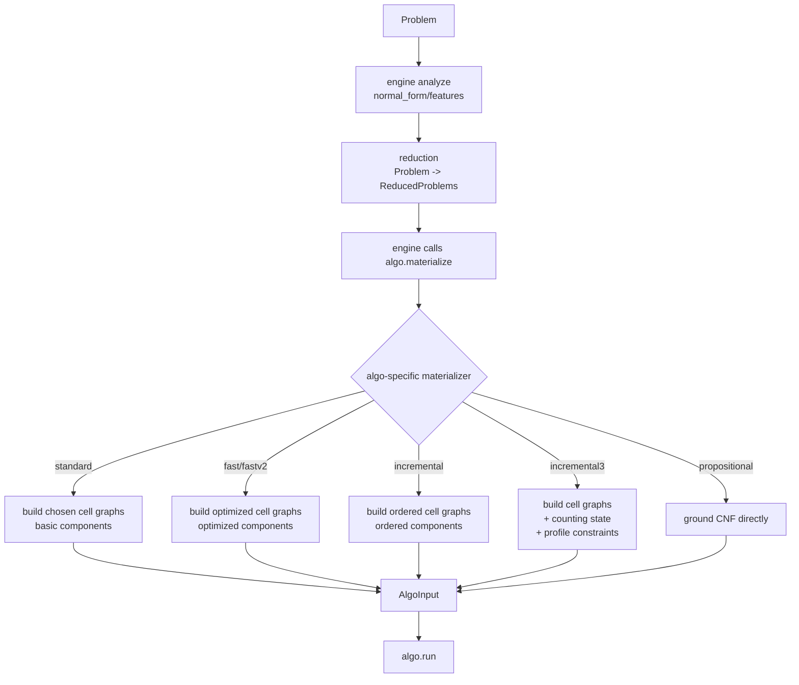

# Algo-Owned Materialization Implementation Plan

> Superseded by `docs/plans/2026-07-07-reduction-engine-algo-consolidated.md`.
> This file is retained only as historical context. Follow the consolidated plan for current decisions.

> **For Claude:** REQUIRED SUB-SKILL: Use superpowers:executing-plans to implement this plan task-by-task.

**Goal:** Make each algorithm own its input materialization from reduced problems, while sharing only low-level cell-graph building blocks and using engine/runtime cache for expensive intermediate artifacts.

**Architecture:** `engine` orchestrates and caches; `reduction` produces `ReducedProblems`; each `algo` materializes its own `AlgoInput` from the reduced problem(s). `algo.cell_graph` should expose reusable construction primitives, not a single global materializer. This avoids a large `CompiledProblem`/`ReducedProblem` artifact and keeps algorithm-specific requirements local.

**Tech Stack:** Python 3.11, existing `wfomc.engine.orchestration`, existing `RuntimeContext` cache, existing `wfomc.algo.*` specs, existing cell graph implementation.

---

## Decision

Do not introduce a universal compiled artifact such as:

```python
CompiledProblem
EngineProblemArtifact
```

Do not keep using backend-heavy `reduction.ReducedProblem` as the long-term materialization artifact.

Instead:

```text
engine:
  analyze / choose algo / call reduction / call algo.materialize / run / cache

reduction:
  Problem -> ReducedProblems

algo/*:
  each algorithm materializes its own input from ReducedProblems

algo/cell_graph:
  shared low-level cell graph building blocks only
```

## Key Constraints

### 1. Each Algorithm Chooses Its Own Cell Graph Construction

Cell graph construction is part of an algorithm's input materialization.

Different algorithms need different variants:

```text
standard:
  basic components

fast:
  optimized components, modified_cell_symmetry=False

fastv2:
  optimized components, modified_cell_symmetry=True

incremental:
  ordered components with linear/predecessor/circular metadata

incremental3:
  counting-DP components plus counting state and profile/cardinality masks

recursive:
  basic/ordered cell graph choices tied to recursive solver needs

tail-signature:
  cell graph components converted into tail-signature tables

propositional:
  may bypass cell graph and ground CNF directly
```

Therefore, do not create:

```python
build_cell_graph_input(reduced)
```

as a universal materializer.

Instead, expose reusable pieces from `algo.cell_graph`, and let each algo compose them.

### 2. Materializers Receive Reduced Problems, Not Only Cell Graphs

Algorithms may need more than cell graphs.

Example: incremental3 needs:

- reduced problem branch;
- cell graph;
- counting state;
- unary/profile capacity information;
- weights;
- domain;
- decode/correction data.

So materializer shape should be closer to:

```python
def materialize(reduced: ReducedProblems, ctx: MaterializationContext) -> AlgoInput:
    ...
```

not:

```python
def materialize(cell_graphs) -> AlgoInput:
    ...
```

The reduced problem remains available to algorithm materializers.

### 3. Engine Owns Cache

For performance, expensive shared intermediate artifacts should be cached through `RuntimeContext`.

Cache owner:

```text
engine/runtime
```

not:

```text
reduction
```

and not hidden inside global module state.

Candidate cache layers:

```text
normal_form
feature_set
reduction_result
prepared qf/cell-graph formula
cell_graphs
cell_graph components
profile compatibility
counting state
algo_input
solver result
```

Cache keys must include all semantics-affecting knobs:

```text
algo name
algo options
reduced problem key
cell graph mode
optimized flag
modified symmetry flag
order metadata
profile_capacity_constraint
weight backend/options
domain size
```

## Proposed Materialization Context

Add a small context object, likely under `src/wfomc/engine/orchestration.py` or `src/wfomc/engine/materialization.py`:

```python
@dataclass(frozen=True)
class MaterializationContext:
    runtime: RuntimeContext
    normal_form: C2NormalForm | None
    features: FeatureSet
    options: AlgoOptions
```

This keeps `AlgoSpec.materialize` from gaining many positional parameters.

Alternative if avoiding a new object:

```python
materialize(
    reduced,
    *,
    normal_form,
    features,
    options,
    runtime,
)
```

Prefer `MaterializationContext` if more than two algorithms need cache-aware materialization.

## Proposed `AlgoSpec`

Current shape:

```python
@dataclass(frozen=True)
class AlgoSpec:
    name: AlgoName
    resolve_options: Callable
    reduce: Callable
    materialize: Callable
    run: Callable
```

Keep this shape initially.

Change materialize convention from:

```python
materialize(reduced) -> AlgoInput
```

to:

```python
materialize(reduced, ctx: MaterializationContext) -> AlgoInput
```

Do not add a universal compile artifact between reduction and materialization.

## Engine Flow

Target flow:

```python
analysis = analyze_problem(problem, runtime=context)
resolved_options = spec.resolve_options(analysis.feature_set, options)

reduced = context.cache.get_or_build(
    "reductions",
    reduction_key,
    lambda: spec.reduce(problem, options=resolved_options),
)

materialization_context = MaterializationContext(
    runtime=context,
    normal_form=analysis.normal_form,
    features=analysis.feature_set,
    options=resolved_options,
)

algo_input = context.cache.get_or_build(
    "algo_inputs",
    algo_input_key,
    lambda: spec.materialize(reduced, materialization_context),
)
```

If `spec.reduce` still temporarily needs `normal_form/features/options`, keep the old signature during migration, but do not encode those fields into a shared `ReducedProblem` artifact.

## Shared Cell Graph Building Blocks

`src/wfomc/algo/cell_graph` should provide building blocks such as:

```python
prepare_cell_graph_formula(...)
build_cell_graphs(...)
extract_cell_tables(...)
build_basic_component(...)
build_optimized_component(...)
build_ordered_component(...)
build_counting_component(...)
build_profile_compatibility(...)
```

Avoid one function that tries to decide every algorithm's final input shape.

Good:

```python
def build_standard_input(reduced, ctx):
    cell_graphs = ctx.runtime.cache.get_or_build(
        "cell_graphs",
        key,
        lambda: build_cell_graphs(...),
    )
    components = tuple(build_basic_component(graph) for graph in cell_graphs)
    return BasicCellGraphInput(...)
```

Also good:

```python
def build_counting_dp_input(reduced, ctx):
    counting_state = ctx.runtime.cache.get_or_build(
        "counting_state",
        key,
        lambda: build_counting_state(...),
    )
    cell_graphs = ctx.runtime.cache.get_or_build(
        "cell_graphs",
        key,
        lambda: build_cell_graphs(...),
    )
    components = tuple(build_counting_component(graph, counting_state) for graph in cell_graphs)
    return CountingDPInput(...)
```

Bad:

```python
def build_input_from_reduced(reduced, algo):
    if algo == ...
```

## Target Flow Diagram



## Migration Strategy

### Task 1: Introduce `MaterializationContext`

**Files:**
- Modify: `src/wfomc/engine/orchestration.py`
- Modify: `src/wfomc/algo/core.py`

Steps:

1. Add `MaterializationContext`.
2. Update `AlgoSpec.materialize` typing to accept `(reduced, ctx)`.
3. Update `engine.compile_problem()` to pass the context.
4. Keep adapters for existing one-argument materializers if needed:

```python
def _call_materialize(materialize, reduced, ctx):
    try:
        return materialize(reduced, ctx)
    except TypeError:
        return materialize(reduced)
```

Only use the adapter during migration; remove after all materializers are updated.

### Task 2: Move Cache-Aware Cell Graph Building Into Algo Materializers

**Files:**
- Modify: `src/wfomc/algo/cell_graph/inputs.py`
- Modify: algorithm-specific `spec.py`/`input.py` files as needed.

Steps:

1. Update standard materializer to use `ctx.runtime.cache`.
2. Update fast and fastv2 materializers.
3. Update incremental materializer.
4. Update recursive/tail-signature materializers.
5. Keep shared primitives in `algo.cell_graph`.

### Task 3: Move Incremental3-Specific Materialization Out of Shared Reduction Artifact

**Files:**
- Modify: `src/wfomc/algo/incremental3/input.py`
- Modify: `src/wfomc/algo/incremental3/spec.py`
- Move later: `src/wfomc/reduction/counting_state.py` -> `src/wfomc/algo/incremental3/counting_state.py`
- Move later: `src/wfomc/reduction/compat/counting_state.py` -> `src/wfomc/algo/incremental3/compat.py`

Steps:

1. Build counting state inside incremental3 materializer.
2. Cache counting state using `ctx.runtime.cache`.
3. Pass reduced problem and counting state to counting component builder.
4. Remove dependency on `reduced.counting_state` after the materializer owns it.

### Task 4: Remove Need for Universal Backend Artifact

Once all materializers compute their own needs:

- stop adding new fields to old `ReducedProblem`;
- stop depending on old `ReducedProblem` as a long-term public object;
- replace it with pure `ReducedProblems` from `reduction.core`.

Do not introduce `CompiledProblem` to replace it.

### Task 5: Update Tests

Update tests to assert:

```text
engine calls spec.materialize with MaterializationContext
each algo materializer can use runtime cache
cell graph cache keys include algo-specific construction options
incremental3 materializer owns counting state
reduction result is not backend-heavy
```

## Acceptance Criteria

- No universal `CompiledProblem` or replacement backend artifact is introduced.
- Each algorithm owns its own materialization function.
- `algo.cell_graph` exposes shared primitives, not a global materializer.
- Incremental3 materialization receives the reduced problem and builds its extra state itself.
- Runtime cache is available to materializers through `MaterializationContext`.
- Expensive cell graph and counting-state intermediates are cacheable with algo-specific keys.
- `reduction` does not construct cell graphs or algorithm inputs.
