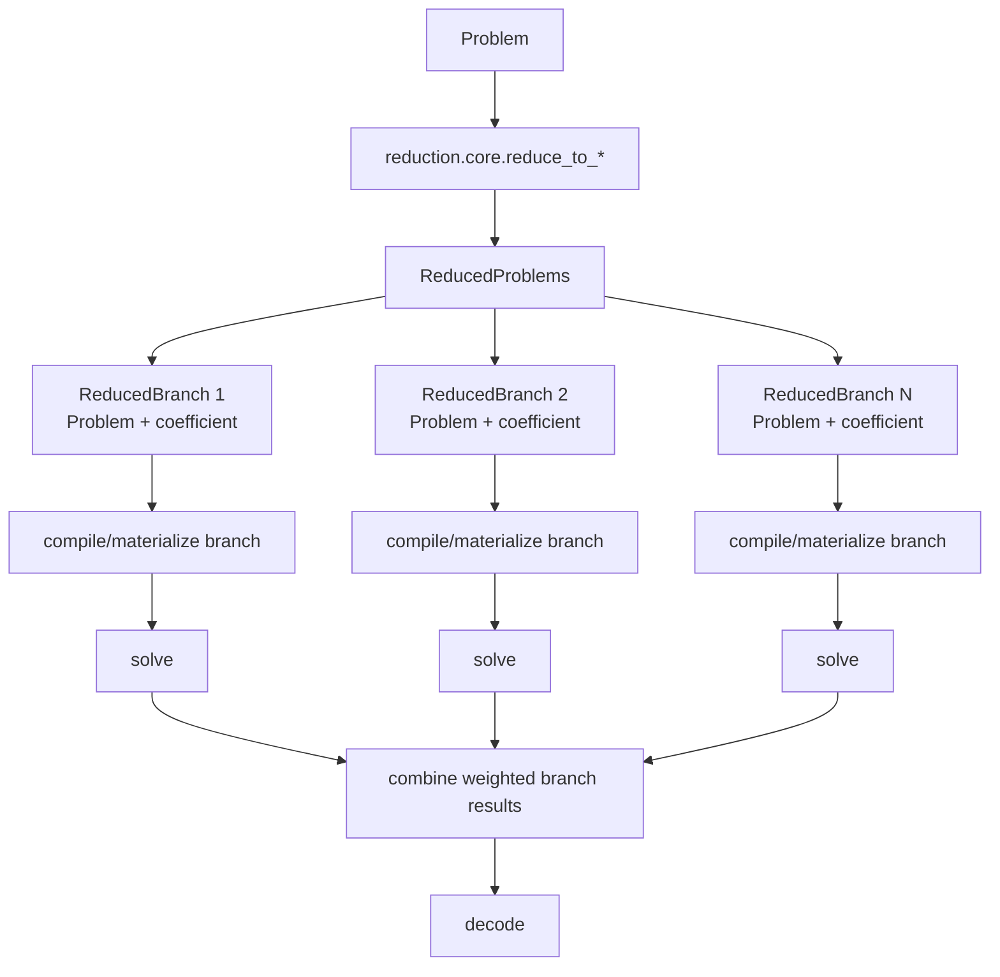

# Reduction Core Contract Implementation Plan

> Superseded by `docs/plans/2026-07-07-reduction-engine-algo-consolidated.md`.
> This file is retained only as historical context. Follow the consolidated plan for current decisions.

> **For Claude:** REQUIRED SUB-SKILL: Use superpowers:executing-plans to implement this plan task-by-task.

**Goal:** Redefine `wfomc.reduction` as a pure logical reduction layer whose public contract is `Problem -> Problems`, with the contract and orchestration kept directly in `core.py`.

**Architecture:** `reduction` should transform one logical `Problem` into one or more reduced logical problem branches. It should not build solver inputs, cell graphs, evidence execution plans, counting DP state, ring-weight tables, or backend-specific artifacts. Keep the public data structures and main reduction functions in `src/wfomc/reduction/core.py`; do not split them into `pipeline.py` or `output.py`.

**Tech Stack:** Python 3.11, dataclasses, typed `wfomc.problem.Problem`, typed `wfomc.fol`, existing reduction rules, pytest.

---

## Decision

Use a pure reduction contract:

```text
Problem -> ReducedProblems
```

Where `ReducedProblems` contains one or more logical branches:

```text
ReducedProblems
  branches: tuple[ReducedBranch, ...]
  decode: DecodePipeline
  metadata: Mapping[str, object]

ReducedBranch
  problem: Problem
  coefficient: object
  metadata: Mapping[str, object]
```

The semantics are:

```text
answer(original_problem)
  = decode(sum(branch.coefficient * solve(branch.problem)
               for branch in reduced.branches))
```

This leaves room for future reductions that naturally produce several subproblems:

- case splits;
- conditioning;
- domain decomposition;
- evidence/profile splitting;
- disjoint component decomposition;
- inclusion-exclusion style reductions.

## Naming Decision

Do not create:

```text
src/wfomc/reduction/pipeline.py
src/wfomc/reduction/output.py
```

Put the public contract and orchestration directly in:

```text
src/wfomc/reduction/core.py
```

Reason:

- `core.py` is plain and matches the conceptual center of the package.
- `pipeline.py` suggests an engineering workflow rather than a mathematical transformation.
- `output.py` creates a small abstraction file before there is enough weight to justify it.
- Keeping the contract in `core.py` makes `from wfomc.reduction import reduce_to_ufo2, ReducedProblems` obvious.

## Target Package Shape

```text
src/wfomc/reduction/
  __init__.py
  core.py            # ReducedBranch, ReducedProblems, public reduce_* functions
  counting.py        # counting-related logical reduction rules
  skolem.py          # existential/skolem logical reduction rules
  normal_form.py     # Problem/normal-form composition helpers
  decode.py          # decode steps, if still independent enough to keep separate
  compat/            # temporary legacy lowering/adapters only
```

The current backend-heavy `ReducedProblem` is not a pure reduction result. It should be moved or renamed later as a compile/materialization artifact.

Preferred future naming:

```text
reduction.ReducedProblems       # pure logical reduction result
compile.CompiledProblem         # backend/algorithm-ready artifact
```

If a new `compile` package feels too broad at first, place compile artifacts under existing algorithm/materialization modules, but do not keep them in pure `reduction`.

## What Reduction May Do

`reduction` may:

- rewrite formulas while preserving or explicitly decoding semantics;
- eliminate counting quantifiers into logical formulas plus branch coefficients/constraints;
- skolemize existentials with decode/correction metadata;
- normalize a `Problem` into a target logical fragment;
- split one `Problem` into multiple logical branches;
- attach branch coefficients;
- attach reduction metadata that remains logical and backend-independent;
- preserve domain, weights, evidence, and cardinality constraints as `Problem` data.

## What Reduction Must Not Do

`reduction` must not:

- build `CellGraph`;
- build incremental3 `CountingState`;
- build `UnaryCardinalityMasks`;
- convert weights to ring elements;
- apply backend-specific cardinality weighting;
- choose algorithms;
- inspect runtime/cache;
- materialize solver inputs;
- own cell-graph order metadata as a backend artifact;
- construct evidence execution plans for specific algorithms.

Those belong to compilation/materialization:

```text
Problem branch -> backend input
```

not to logical reduction:

```text
Problem -> Problems
```

## Proposed `core.py` Contract

Add these public data structures to `src/wfomc/reduction/core.py`:

```python
from __future__ import annotations

from dataclasses import dataclass, field
from types import MappingProxyType
from typing import Mapping

from wfomc.problem import Problem
from wfomc.reduction.decode import DecodePipeline


@dataclass(frozen=True)
class ReducedBranch:
    problem: Problem
    coefficient: object = 1
    metadata: Mapping[str, object] = field(default_factory=dict)


@dataclass(frozen=True)
class ReducedProblems:
    branches: tuple[ReducedBranch, ...]
    decode: DecodePipeline = field(default_factory=DecodePipeline.identity)
    metadata: Mapping[str, object] = field(default_factory=dict)

    @classmethod
    def single(
        cls,
        problem: Problem,
        *,
        coefficient: object = 1,
        decode: DecodePipeline | None = None,
        metadata: Mapping[str, object] | None = None,
    ) -> "ReducedProblems":
        return cls(
            branches=(ReducedBranch(problem, coefficient),),
            decode=decode or DecodePipeline.identity(),
            metadata=metadata or {},
        )
```

If `DecodePipeline.identity()` does not exist yet, add it to `src/wfomc/reduction/decode.py`:

```python
@classmethod
def identity(cls) -> "DecodePipeline":
    return cls()
```

## Public Functions

Keep function names concrete and target-oriented:

```python
def reduce_to_ufo2(problem: Problem) -> ReducedProblems:
    ...


def reduce_to_counting_problem(problem: Problem) -> ReducedProblems:
    ...
```

Avoid a generic `reduce(problem, target=...)` until there are enough targets to justify it.

Later, if needed:

```python
class ReductionTarget(Enum):
    UFO2 = "ufo2"
    COUNTING = "counting"
```

But do not introduce this enum prematurely.

## Migration Strategy

### Task 1: Add New Pure Contract Without Removing Old Artifacts

**Files:**
- Modify: `src/wfomc/reduction/core.py`
- Modify: `src/wfomc/reduction/__init__.py`
- Test: `tests/unit/test_reduction_core_contract.py`

Add `ReducedBranch` and `ReducedProblems` alongside the current transitional `ReducedProblem`.

Export:

```python
from .core import ReducedBranch, ReducedProblems
```

Do not delete the current backend-heavy `ReducedProblem` in the same step.

### Task 2: Add Contract Tests

Create `tests/unit/test_reduction_core_contract.py`:

```python
from wfomc.problem import Problem
from wfomc.reduction import ReducedBranch, ReducedProblems


def test_reduced_problems_single_wraps_problem():
    problem = Problem(sentence=None, domain=frozenset(), weights={})

    reduced = ReducedProblems.single(problem)

    assert len(reduced.branches) == 1
    assert reduced.branches[0].problem is problem
    assert reduced.branches[0].coefficient == 1
```

Adjust `Problem(...)` construction to match the actual constructor if needed.

### Task 3: Rename Current Backend-Heavy Result Internally

The current `ReducedProblem` includes backend/materialization fields such as:

- `normal_form`;
- `features`;
- `options`;
- `qf_formula`;
- ring weights;
- `EvidencePlan`;
- `CountingState`;
- `UnaryCardinalityMasks`;
- order metadata;
- `DecodePipeline`.

This is not the pure reduction contract.

Rename it later to something like:

```python
CompiledReductionArtifact
```

or move it to a compile/materialization package.

Do not keep extending it as the public meaning of “reduction result.”

### Task 4: Move Backend Preparation Out of Reduction

Move or split these responsibilities out of `reduction/core.py`:

- evidence execution planning;
- ring weight conversion;
- cardinality weighting;
- incremental3 counting-state extraction;
- cell-graph-specific qf formula preparation;
- algorithm options/features threading.

Candidate destination:

```text
src/wfomc/compile/
  core.py
  evidence.py
  weights.py
  incremental3.py
  cell_graph.py
```

If `compile/` is too much churn, move backend prep toward:

```text
src/wfomc/engine/
src/wfomc/algo/*/inputs.py
```

The invariant remains: pure `reduction` returns logical `Problem` branches.

### Task 5: Make Existing Algorithm Entry Points Consume Compiled Artifacts

The engine should eventually do:

```text
Problem
  -> reduction.ReducedProblems
  -> compile each ReducedBranch for selected algorithm
  -> solve each compiled branch
  -> combine branch coefficients
  -> decode
```

Not:

```text
Problem + normal_form + features + options
  -> reduction.ReducedProblem backend artifact
  -> solver
```

## Flow Diagram



## Important Boundary

Current `reduction.compat` work is still useful, but it is only a transitional containment boundary.

The long-term boundary should be:

```text
reduction/compat = temporary legacy lowering for logical transformations
compile/compat   = temporary legacy lowering for backend materialization
```

Do not let `reduction.compat` become a permanent home for cell-graph or incremental3 backend preparation.

## Acceptance Criteria

- `ReducedBranch` and `ReducedProblems` live in `src/wfomc/reduction/core.py`.
- `wfomc.reduction.__init__` exports the pure contract.
- No `pipeline.py` or `output.py` is introduced for this contract.
- New tests cover the basic `Problem -> ReducedProblems` shape.
- Existing backend-heavy `ReducedProblem` is clearly marked transitional or renamed/moved in a later step.
- Documentation describes `reduction` as logical transformation only, not backend preparation.
