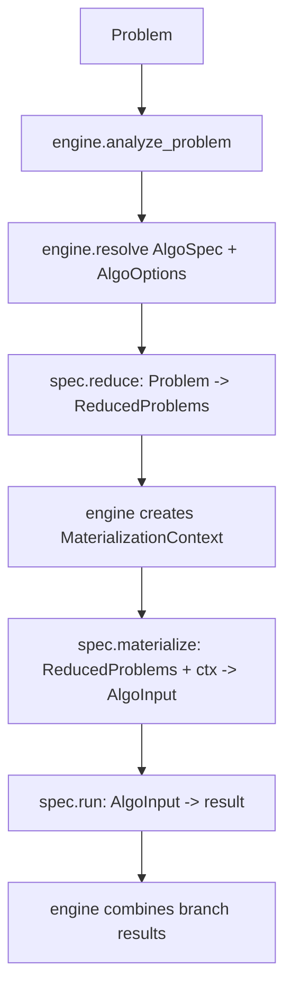

# Reduction Engine Algo Consolidation Implementation Plan

> **For Claude:** REQUIRED SUB-SKILL: Use superpowers:executing-plans to implement this plan task-by-task.

**Goal:** Consolidate the latest reduction, unary evidence, weight arithmetic, and algorithm materialization decisions into one implementation path.

**Architecture:** `reduction` is a pure logical layer with the contract `Problem -> ReducedProblems`. `engine` orchestrates analysis, reduction, caching, materialization, and execution. Each `algo` owns its own input materialization, while `algo.cell_graph` only provides reusable low-level construction primitives.

**Tech Stack:** Python 3.11, dataclasses, typed `wfomc.problem.Problem`, typed `wfomc.fol`, python-flint, existing `wfomc.engine`, `wfomc.algo`, and `wfomc.reduction`.

---

## Status

This is the authoritative merged plan for the current refactor round.

It supersedes:

- `docs/plans/2026-07-07-reduction-core-contract.md`
- `docs/plans/2026-07-07-algo-owned-materialization.md`
- `docs/plans/2026-07-07-unary-evidence-profile-capacity-reduction.md`
- `docs/plans/2026-07-07-weight-arithmetic-backend.md`

Do not use `docs/plans/2026-07-07-reduction-compat-layout.md` as input for this merge; it is intentionally out of scope.

## Authoritative Decisions

1. `reduction` has one public conceptual contract:

```text
Problem -> ReducedProblems
```

2. `reduction` may produce one or more logical branches, but it must not build solver/backend inputs.
3. Do not add `pipeline.py` or `output.py`; keep the public reduction contract in `src/wfomc/reduction/core.py`.
4. Do not introduce `CompiledProblem`, `EngineProblemArtifact`, or any universal backend-ready artifact.
5. Each algorithm owns its own materialization from `ReducedProblems` to its input type.
6. Each algorithm decides how to build its cell graph because the cell graph is part of that algorithm's input construction.
7. `src/wfomc/algo/cell_graph` provides shared primitives only, not a global materializer.
8. Materializers receive the reduced problems and a materialization context, not only a prebuilt cell graph.
9. `engine` and runtime context own caching.
10. Unary evidence has two reduction paths:
    - unary evidence to cardinality-constraint encoding;
    - unary evidence to exactly one `ProfileCapacityConstraint`.
11. `Problem` should have one singular field:

```python
profile_capacity_constraint: ProfileCapacityConstraint | None
```

12. Weight arithmetic is engine/materialization planning, not reduction.
13. Users choose weight precision mode: `exact` or `round`.
14. WFOMC chooses scalar, polynomial, or multivariate polynomial backend from the number of symbolic variables.

## Target Ownership

```text
wfomc.reduction
  Pure logical transformations:
    Problem -> ReducedProblems

wfomc.engine
  Analyze problem
  Resolve algo/options
  Run reductions
  Own runtime cache
  Build MaterializationContext
  Call algo.materialize(...)
  Call algo.run(...)
  Combine branch results

wfomc.algo.*
  Own algorithm-specific input materialization
  Own algorithm-specific cell graph construction choices
  Own algorithm-specific counting/profile/weight consumption

wfomc.algo.cell_graph
  Shared low-level cell graph builders and table helpers only

wfomc.evidence
  UnaryEvidence
  EvidenceProfile
  EvidencePartition
  ProfileCapacityConstraint

wfomc.weights
  WeightOptions
  WeightPlan
  ArithmeticBackend
  symbolic-variable discovery
  weight compilation to Python/FLINT values
```

## Non-Goals

Do not add:

```text
src/wfomc/reduction/pipeline.py
src/wfomc/reduction/output.py
CompiledProblem
EngineProblemArtifact
build_cell_graph_input(reduced)
profile_capacities: tuple[ProfileCapacityConstraint, ...]
```

Do not keep these responsibilities in `reduction`:

- cell graph construction;
- incremental counting state construction;
- unary cardinality mask construction;
- evidence execution plans for a specific algorithm;
- weight conversion to ring/FLINT values;
- algorithm selection;
- runtime/cache access;
- solver input materialization.

## Target Flow



## Core Reduction Contract

Add the pure public contract in `src/wfomc/reduction/core.py`:

```python
from __future__ import annotations

from dataclasses import dataclass, field
from typing import Mapping

from wfomc.problem import Problem


@dataclass(frozen=True)
class ReducedBranch:
    problem: Problem
    coefficient: object = 1
    metadata: Mapping[str, object] = field(default_factory=dict)


@dataclass(frozen=True)
class ReducedProblems:
    branches: tuple[ReducedBranch, ...]
    metadata: Mapping[str, object] = field(default_factory=dict)

    @classmethod
    def single(
        cls,
        problem: Problem,
        *,
        coefficient: object = 1,
        metadata: Mapping[str, object] | None = None,
    ) -> "ReducedProblems":
        return cls(
            branches=(ReducedBranch(problem=problem, coefficient=coefficient),),
            metadata={} if metadata is None else metadata,
        )
```

Keep the contract intentionally small. If a reduction needs semantic correction, model it through branch coefficients and branch metadata first. Do not put the current backend-oriented `DecodePipeline` into this core contract.

Recommended public functions:

```python
def reduce_to_ufo2(problem: Problem, *, options: object | None = None) -> ReducedProblems:
    ...


def reduce_unary_evidence_to_profile_capacity(problem: Problem) -> Problem:
    ...


def reduce_unary_evidence_to_cardinality_constraints(problem: Problem) -> Problem:
    ...
```

The current backend-heavy `ReducedProblem` can remain temporarily during migration, but it should be marked private/deprecated and removed after algorithm materializers stop depending on it.

## Unary Evidence Reduction

### Target Data Model

Add to `src/wfomc/evidence.py`:

```python
@dataclass(frozen=True)
class ProfileCapacityConstraint:
    profiles: tuple[EvidenceProfile, ...]
    domain_size: int
    assignment_count: object = 1

    @property
    def is_empty(self) -> bool:
        return not self.profiles

    @classmethod
    def from_unary_evidence(
        cls,
        evidence: UnaryEvidence,
        domain: frozenset[object],
    ) -> "ProfileCapacityConstraint":
        partition = EvidencePartition.from_evidence(evidence, domain)
        return cls(
            profiles=partition.profiles,
            domain_size=partition.domain_size,
            assignment_count=partition.assignment_count,
        )
```

Add to `src/wfomc/problem.py`:

```python
profile_capacity_constraint: ProfileCapacityConstraint | None = None
```

### Profile-Capacity Path

Implement in `src/wfomc/reduction/core.py` or a small reduction helper imported by `core.py`:

```python
from dataclasses import replace

from wfomc.evidence import ProfileCapacityConstraint, UnaryEvidence
from wfomc.problem import Problem


def reduce_unary_evidence_to_profile_capacity(problem: Problem) -> Problem:
    evidence = getattr(problem, "unary_evidence", None)
    if evidence is None or getattr(evidence, "is_empty", False):
        return problem
    if problem.profile_capacity_constraint is not None:
        raise ValueError(
            "Cannot reduce unary_evidence to profile_capacity_constraint when "
            "problem.profile_capacity_constraint is already set"
        )

    return replace(
        problem,
        profile_capacity_constraint=ProfileCapacityConstraint.from_unary_evidence(
            evidence,
            frozenset(problem.domain),
        ),
        unary_evidence=UnaryEvidence(),
    )
```

The result has exactly one `ProfileCapacityConstraint` and clears `unary_evidence`.

### Cardinality-Constraint Path

Keep this as a sibling reduction:

```python
def reduce_unary_evidence_to_cardinality_constraints(problem: Problem) -> Problem:
    ...
```

The result patches the sentence/cardinality metadata and clears `unary_evidence`.

### Materializer Consumption

Algorithm materializers consume `problem.profile_capacity_constraint` directly. For typed/legacy compatibility during transition, materializers should build a local predicate identity map keyed by stable predicate identity:

```python
(predicate.name, predicate.arity)
```

Do not compare typed predicate objects against legacy predicate objects by identity.

Required unary predicates should be derived from all profiles in `profile_capacity_constraint`, so cell/profile allocation sees the predicates used by evidence even when the formula itself does not mention them.

## Weight Arithmetic Plan

### Options

Add to `src/wfomc/weights.py`:

```python
from dataclasses import dataclass
from typing import Literal


@dataclass(frozen=True)
class WeightOptions:
    precision: Literal["exact", "round"] = "exact"
    rounded_backend: Literal["float", "arb"] = "arb"
```

Add to `src/wfomc/algo/core.py`:

```python
@dataclass(frozen=True)
class AlgoOptions:
    ...
    weight_options: WeightOptions = field(default_factory=WeightOptions)
```

Keep any existing `arithmetic_backend` option only as a temporary compatibility alias. New code should use `weight_options`.

### Backend Matrix

| Precision | 0 symbolic vars | 1 symbolic var | 2+ symbolic vars |
|---|---|---|---|
| `exact` | `fmpz` or `fmpq` | `fmpz_poly` or `fmpq_poly` | `fmpz_mpoly` or `fmpq_mpoly` |
| `round` + `float` | `float` | unsupported initially | unsupported |
| `round` + `arb` | `arb` | `arb_poly` | unsupported because python-flint has no `arb_mpoly` |

Initial implementation may default exact backends to rational-capable variants:

```text
fmpq
fmpq_poly
fmpq_mpoly
```

Then optimize to integer-capable variants once value inspection is reliable.

### Plan Object

Add:

```python
@dataclass(frozen=True)
class WeightPlan:
    options: WeightOptions
    symbolic_variables: tuple[str, ...]
    backend: ArithmeticBackend
```

Build `WeightPlan` in engine/materialization, never in pure reduction.

### Symbolic Variable Discovery

Add:

```python
def collect_symbolic_weight_variables(problem: Problem) -> tuple[str, ...]:
    ...
```

Sources:

- symbolic weights;
- symbolic variables introduced by cardinality constraints;
- symbolic variables introduced by profile/cardinality reductions.

Return a stable order:

```python
return tuple(sorted(variables))
```

### Backend Selection

Add:

```python
def choose_weight_backend(
    options: WeightOptions,
    *,
    symbolic_variables: tuple[str, ...],
    raw_weights: object,
) -> ArithmeticBackend:
    ...
```

Rounded multivariate symbolic arithmetic should raise a clear unsupported-backend error until python-flint exposes the needed backend.

### Compilation Boundary

Add:

```python
def compile_weight_mapping(
    weights: Mapping[object, tuple[object, object]],
    plan: WeightPlan,
) -> dict[object, tuple[object, object]]:
    ...
```

This belongs to engine/materialization. `reduction` must preserve raw weights as logical problem data.

## Algo-Owned Materialization

### Materialization Context

Add in `src/wfomc/engine/orchestration.py` or `src/wfomc/engine/materialization.py`:

```python
@dataclass(frozen=True)
class MaterializationContext:
    runtime: RuntimeContext
    normal_form: C2NormalForm | None
    features: FeatureSet
    options: AlgoOptions
```

Add fields only when multiple algorithms need them. Keep it small.

### AlgoSpec Shape

Change `src/wfomc/algo/core.py` from:

```python
materialize: Callable[[object], object]
```

to:

```python
materialize: Callable[[ReducedProblems, MaterializationContext], object]
```

If a staged migration is needed, support a temporary adapter:

```python
def _materialize_with_optional_context(materialize, reduced, ctx):
    try:
        return materialize(reduced, ctx)
    except TypeError:
        return materialize(reduced)
```

Remove the adapter once all algorithms are updated.

### Engine Flow

Target flow in `src/wfomc/engine/orchestration.py`:

```python
analysis = analyze_problem(problem, runtime=runtime)
resolved_options = spec.resolve_options(analysis.feature_set, options)

reduced = runtime.cache.get_or_build(
    "reductions",
    reduction_key(problem, spec.name, resolved_options),
    lambda: spec.reduce(problem, options=resolved_options),
)

ctx = MaterializationContext(
    runtime=runtime,
    normal_form=analysis.normal_form,
    features=analysis.feature_set,
    options=resolved_options,
)

algo_input = runtime.cache.get_or_build(
    "algo_inputs",
    algo_input_key(reduced, spec.name, resolved_options),
    lambda: spec.materialize(reduced, ctx),
)

result = spec.run(algo_input)
```

### Cache Keys

Cache keys must include all semantics-affecting knobs:

- algorithm name;
- algorithm options;
- reduced problem structural key;
- cell graph mode;
- optimized flag;
- modified symmetry flag;
- order metadata;
- `profile_capacity_constraint`;
- `weight_options`;
- symbolic variables;
- domain size.

For expensive shared pieces, cache at the engine/runtime level and pass the runtime cache through `MaterializationContext`.

### Cell Graph Module

Keep `src/wfomc/algo/cell_graph` as shared primitives:

```text
prepare cell-graph formula
build cells/components
extract tables
compute profile compatibility
common cache key helpers
```

Do not add a single public "materialize reduced problem to cell graph input" function.

Each algorithm composes these primitives differently.

### Incremental3 Ownership

Move incremental3-specific materialization concerns into the incremental3 algorithm module:

- counting state;
- unary/profile capacity masks;
- cardinality/profile compatibility structures;
- any DP-specific tables.

The incremental3 materializer receives the reduced problem and can use `MaterializationContext` for analysis data and cache.

## Migration Tasks

### Task 1: Add Pure Reduction Contract

**Files:**
- Modify: `src/wfomc/reduction/core.py`
- Modify: `src/wfomc/reduction/__init__.py`
- Test: `tests/unit/reduction/test_core_contract.py`

**Step 1: Write failing tests**

```python
def test_reduced_problems_single_wraps_problem():
    reduced = ReducedProblems.single(problem)
    assert len(reduced.branches) == 1
    assert reduced.branches[0].problem is problem
    assert reduced.branches[0].coefficient == 1
```

**Step 2: Implement `ReducedBranch` and `ReducedProblems`**

Add the dataclasses from the contract section.

**Step 3: Export the public contract**

Update `src/wfomc/reduction/__init__.py` to export:

```python
ReducedBranch
ReducedProblems
```

**Step 4: Mark backend-heavy `ReducedProblem` transitional**

Add a comment or rename internally only if the current code can tolerate it. Do not break callers yet.

**Step 5: Run tests**

Run:

```bash
pytest tests/unit/reduction/test_core_contract.py -v
```

Expected: pass.

### Task 2: Add Profile Capacity Constraint

**Files:**
- Modify: `src/wfomc/evidence.py`
- Modify: `src/wfomc/problem.py`
- Test: `tests/unit/test_evidence_partition.py`

**Step 1: Write failing tests**

Test that `ProfileCapacityConstraint.from_unary_evidence(...)` preserves:

- profiles;
- domain size;
- assignment count.

**Step 2: Add the dataclass**

Implement the data model from the unary evidence section.

**Step 3: Add `Problem.profile_capacity_constraint`**

Default it to `None`.

**Step 4: Run focused tests**

```bash
pytest tests/unit/test_evidence_partition.py -v
```

Expected: pass.

### Task 3: Implement Unary Evidence Reductions

**Files:**
- Modify: `src/wfomc/reduction/core.py`
- Modify or create: `tests/unit/reduction/test_unary_evidence_reduction.py`

**Step 1: Write failing tests**

Cases:

- empty unary evidence returns the same logical problem;
- non-empty unary evidence produces one profile capacity constraint;
- result clears `unary_evidence`;
- existing `profile_capacity_constraint` plus non-empty `unary_evidence` raises `ValueError`;
- cardinality-constraint path clears `unary_evidence`.

**Step 2: Implement profile-capacity reduction**

Use `dataclasses.replace`.

**Step 3: Keep CCS path separate**

Do not merge profile-capacity behavior into CCS code.

**Step 4: Run tests**

```bash
pytest tests/unit/reduction/test_unary_evidence_reduction.py -v
```

Expected: pass.

### Task 4: Introduce WeightOptions and WeightPlan

**Files:**
- Modify: `src/wfomc/weights.py`
- Modify: `src/wfomc/algo/core.py`
- Test: `tests/unit/test_weights.py`

**Step 1: Write failing backend-selection tests**

Cover:

- exact with zero symbolic variables -> `FMPQ` initially;
- exact with one symbolic variable -> `FMPQ_POLY`;
- exact with multiple symbolic variables -> `FMPQ_MPOLY`;
- round/arb with zero symbolic variables -> `ARB`;
- round/arb with one symbolic variable -> `ARB_POLY`;
- round/arb with multiple symbolic variables -> unsupported error;
- round/float with symbolic variables -> unsupported error.

**Step 2: Add `WeightOptions`**

Default to exact.

**Step 3: Add/extend `ArithmeticBackend`**

Include scalar, poly, and mpoly variants.

**Step 4: Add `WeightPlan` and backend selection**

Implement `choose_weight_backend`.

**Step 5: Add `AlgoOptions.weight_options`**

Keep existing arithmetic backend fields as compatibility only.

**Step 6: Run tests**

```bash
pytest tests/unit/test_weights.py -v
```

Expected: pass.

### Task 5: Move Weight Compilation Out of Reduction

**Files:**
- Modify: `src/wfomc/reduction/core.py`
- Modify: `src/wfomc/weights.py`
- Modify: relevant algorithm materializers under `src/wfomc/algo/`
- Test: existing algorithm/reduction tests

**Step 1: Identify calls in reduction**

Run:

```bash
rg "convert_weight_mapping_to_ring_elements|choose_arithmetic_backend|compile_weight" src/wfomc/reduction src/wfomc/algo src/wfomc/engine
```

**Step 2: Create `compile_weight_mapping`**

Wrap the old conversion path behind `WeightPlan`.

**Step 3: Change algorithm materializers to compile weights**

Materializers should build:

```python
symbols = collect_symbolic_weight_variables(branch.problem)
plan = WeightPlan(
    options=ctx.options.weight_options,
    symbolic_variables=symbols,
    backend=choose_weight_backend(...),
)
compiled_weights = compile_weight_mapping(branch.problem.weights, plan)
```

**Step 4: Remove weight compilation from reduction**

Reduction should pass raw weights through as problem data.

**Step 5: Run focused tests**

```bash
pytest tests/unit/test_weights.py tests/unit/reduction -v
```

Expected: pass.

### Task 6: Add MaterializationContext

**Files:**
- Modify: `src/wfomc/engine/orchestration.py`
- Modify: `src/wfomc/algo/core.py`
- Test: `tests/unit/engine/test_orchestration.py` or nearest existing tests

**Step 1: Write failing orchestration test**

Create a fake `AlgoSpec` whose `materialize` asserts it receives:

```python
reduced
ctx.runtime
ctx.features
ctx.options
```

**Step 2: Add `MaterializationContext`**

Place it in `engine/orchestration.py` first. Move later only if import cycles require it.

**Step 3: Update `AlgoSpec.materialize` signature**

Use a temporary compatibility adapter if existing algorithms are not migrated in the same commit.

**Step 4: Pass context from engine**

Build the context after reduction and before materialization.

**Step 5: Run tests**

```bash
pytest tests/unit/engine -v
```

Expected: pass.

### Task 7: Move Algorithm Materialization Into Algorithm Modules

**Files:**
- Modify: `src/wfomc/algo/core.py`
- Modify: `src/wfomc/algo/*`
- Modify: `src/wfomc/algo/cell_graph/*`
- Modify: `src/wfomc/engine/orchestration.py`
- Test: algorithm-specific tests

**Step 1: Pick one simple algorithm first**

Start with the algorithm whose current materializer is smallest.

**Step 2: Move its materializer to the algorithm module**

The materializer should consume:

```python
ReducedProblems
MaterializationContext
```

**Step 3: Keep cell graph helpers generic**

If moving code into `algo/cell_graph`, ensure it is a primitive, not an algorithm input builder.

**Step 4: Repeat algorithm by algorithm**

Do not migrate all algorithms in one large commit unless tests are already very localized.

**Step 5: Run per-algorithm tests**

Use the nearest focused test file for each migrated algorithm.

### Task 8: Move Incremental3-Specific State Out of Reduction

**Files:**
- Modify: `src/wfomc/reduction/counting_state.py`
- Modify: incremental3 algorithm module under `src/wfomc/algo/`
- Modify: `src/wfomc/algo/cell_graph/*` if shared primitives are needed
- Test: incremental3 tests

**Step 1: Write regression tests for current behavior**

Cover cases with:

- counting quantifiers;
- unary evidence/profile capacity;
- cardinality constraints;
- typed predicates that currently cross a legacy adapter.

**Step 2: Move counting-state construction into incremental3 materialization**

Incremental3 owns this because it is DP input state, not a logical reduction result.

**Step 3: Fix typed/legacy predicate identity mapping**

Use `(name, arity)` or an equivalent stable identity map at materialization boundaries.

**Step 4: Remove reduction dependency**

`reduction` should no longer return `counting_state` or `unary_cardinality_masks`.

**Step 5: Run focused tests**

```bash
pytest tests -k "incremental3 or counting_state or unary_evidence" -v
```

Expected: pass.

### Task 9: Retire Backend-Heavy ReducedProblem

**Files:**
- Modify: `src/wfomc/reduction/core.py`
- Modify: all callers found by `rg "ReducedProblem|\\.qf_formula|\\.evidence_plan|\\.counting_state|\\.weights" src tests`
- Test: full suite

**Step 1: Find remaining callers**

```bash
rg "ReducedProblem|qf_formula|evidence_plan|counting_state|unary_cardinality_masks|decode" src/wfomc tests
```

**Step 2: Replace fields with algorithm-owned materialization**

Move each remaining backend field to the algorithm that consumes it.

**Step 3: Delete or privatize old artifact**

Once no public callers remain, remove the old dataclass or rename it with a leading underscore if still needed internally.

**Step 4: Run full suite**

```bash
pytest -q
```

Expected: pass.

## Conflict Resolution Notes

### DecodePipeline

The old plan put `DecodePipeline` inside `ReducedProblems`. Do not do that now. The pure contract should remain minimal. If future reductions require result reconstruction beyond branch coefficients, add a small logical result-combination protocol after there is a concrete need.

### CompiledProblem

The old plan mentioned a possible `compile.CompiledProblem`. Do not add it. Current decision is algorithm-owned materialization plus engine-owned orchestration/cache.

### Universal Cell Graph Materializer

Do not centralize cell graph construction behind one high-level function. Shared modules may expose primitives, but each algorithm decides how to build and consume cell graph structures.

### Profile Capacity Cardinality

Use exactly one `ProfileCapacityConstraint | None` on `Problem`. Do not introduce a tuple field.

### Weight Compilation

Weight backend selection and FLINT conversion happen in engine/materialization or algorithm materializers. Reduction preserves weights as problem data.

## Acceptance Criteria

The migration is complete when:

1. `wfomc.reduction` public output is `ReducedProblems`, not backend-heavy `ReducedProblem`.
2. `reduction` no longer constructs cell graphs, counting state, unary masks, evidence execution plans, or compiled weights.
3. Each algorithm's materializer consumes `ReducedProblems` plus `MaterializationContext`.
4. `engine` owns reduction/materialization cache keys and passes cache access through context.
5. Unary evidence profile path produces exactly one `Problem.profile_capacity_constraint`.
6. CCS unary evidence path and profile-capacity unary evidence path are separate reductions.
7. Weight arithmetic is driven by `WeightOptions` and `WeightPlan`.
8. Rounded multivariate symbolic arithmetic fails early with a clear unsupported error.
9. Typed/legacy predicate boundaries compare predicates by stable identity, not object identity.
10. The focused suites pass:

```bash
pytest tests/unit/test_weights.py -v
pytest tests/unit/test_evidence_partition.py -v
pytest tests/unit/reduction -v
pytest tests/unit/engine -v
pytest tests -k "incremental3 or counting_state or unary_evidence" -v
```

11. The full suite passes:

```bash
pytest -q
```
