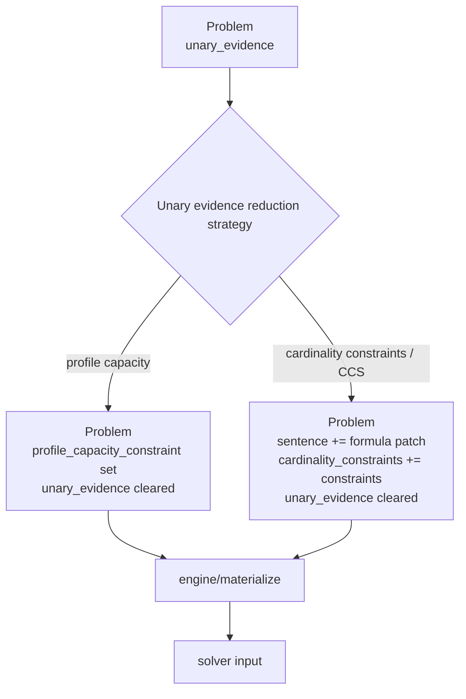

# Unary Evidence Profile Capacity Reduction Implementation Plan

> Superseded by `docs/plans/2026-07-07-reduction-engine-algo-consolidated.md`.
> This file is retained only as historical context. Follow the consolidated plan for current decisions.

> **For Claude:** REQUIRED SUB-SKILL: Use superpowers:executing-plans to implement this plan task-by-task.

**Goal:** Represent the non-CCS unary evidence path as a pure reduction from `Problem.unary_evidence` to one `Problem.profile_capacity_constraint`.

**Architecture:** Unary evidence has two reduction targets: cardinality-constraint encoding (CCS) and profile-capacity constraint. Both are `Problem -> Problem` reductions. There is no separate “lowering” concept. The profile-capacity path produces exactly one `ProfileCapacityConstraint` on the `Problem`; backend materialization later turns that constraint into cell/profile compatibility data.

**Tech Stack:** Python 3.11, dataclasses, typed `wfomc.problem.Problem`, typed `wfomc.evidence`, existing cell-graph materialization.

---

## Decision

Use exactly one profile capacity constraint per `Problem`:

```python
Problem.profile_capacity_constraint: ProfileCapacityConstraint | None
```

Do not introduce:

```python
profile_capacities: tuple[ProfileCapacityConstraint, ...]
```

The plural form may be useful later for many-sorted domains, but it is unnecessary now.

## Concept

Unary evidence induces a partition of the domain into profiles:

```text
profile_i = a set of unary literals
size_i    = how many domain elements have exactly that profile
```

The non-CCS path should encode this as a `ProfileCapacityConstraint`:

```text
Problem(unary_evidence=...)
  -> Problem(profile_capacity_constraint=..., unary_evidence=empty)
```

This is a reduction, not a backend lowering.

## Data Model

Add to `src/wfomc/evidence.py`:

```python
@dataclass(frozen=True)
class ProfileCapacityConstraint:
    profiles: tuple[EvidenceProfile, ...]
    domain_size: int
    assignment_count: object = 1

    @property
    def is_empty(self) -> bool:
        return not self.profiles

    @classmethod
    def from_unary_evidence(
        cls,
        evidence: UnaryEvidence,
        domain: frozenset[object],
    ) -> "ProfileCapacityConstraint":
        partition = EvidencePartition.from_evidence(evidence, domain)
        return cls(
            profiles=partition.profiles,
            domain_size=partition.domain_size,
            assignment_count=partition.assignment_count,
        )
```

This deliberately reuses the existing `EvidenceProfile` and `EvidencePartition` machinery. Do not rename those in the first pass.

## Problem Field

Modify `src/wfomc/problem.py`:

```python
from wfomc.evidence import ProfileCapacityConstraint


@dataclass(frozen=True)
class Problem:
    ...
    profile_capacity_constraint: ProfileCapacityConstraint | None = None
```

The field should default to `None`, not an empty object.

## Reduction Functions

Add profile-capacity reduction:

```python
from dataclasses import replace

from wfomc.evidence import ProfileCapacityConstraint, UnaryEvidence


def reduce_unary_evidence_to_profile_capacity(problem: Problem) -> Problem:
    evidence = getattr(problem, "unary_evidence", None)
    is_empty = getattr(evidence, "is_empty", None)
    if evidence is None or (is_empty is not None and is_empty) or not evidence:
        return problem

    return replace(
        problem,
        profile_capacity_constraint=ProfileCapacityConstraint.from_unary_evidence(
            evidence,
            frozenset(getattr(problem, "domain", ()) or ()),
        ),
        unary_evidence=UnaryEvidence(),
    )
```

Add CCS/cardinality reduction separately:

```python
def reduce_unary_evidence_to_cardinality_constraints(problem: Problem) -> Problem:
    ...
```

These are sibling reductions:

```text
unary evidence -> profile capacity constraint
unary evidence -> formula patch + cardinality constraints
```

Do not model either path as “lowering”.

## Flow



## Cell Graph Consumption

Backend materialization should consume the constraint, not `EvidencePlan.partition`.

Target shape:

```python
def _framework_cell_evidence_allocation(reduced: object, cells: tuple[object, ...]):
    constraint = getattr(reduced, "profile_capacity_constraint", None)
    if constraint is None or constraint.is_empty:
        return None
    return CellEvidenceAllocation.from_profile_capacity_constraint(constraint, cells)
```

Add this adapter to `CellEvidenceAllocation` first:

```python
@classmethod
def from_profile_capacity_constraint(
    cls,
    constraint: ProfileCapacityConstraint,
    cells: tuple[CellEvidenceView, ...],
) -> "CellEvidenceAllocation":
    partition = EvidencePartition(
        profiles=constraint.profiles,
        domain_size=constraint.domain_size,
        assignment_count=constraint.assignment_count,
    )
    return cls.from_partition(partition, cells)
```

This keeps the initial change small and avoids rewriting cell enumeration logic.

## Transitional Compatibility

During migration, allow fallback:

```python
constraint = getattr(reduced, "profile_capacity_constraint", None)
if constraint is None:
    evidence_plan = getattr(reduced, "evidence_plan", None)
    partition = getattr(evidence_plan, "partition", None)
    if partition is not None:
        constraint = ProfileCapacityConstraint(
            profiles=partition.profiles,
            domain_size=partition.domain_size,
            assignment_count=partition.assignment_count,
        )
```

Remove this fallback after all profile path callers populate `Problem.profile_capacity_constraint`.

## Where This Belongs

Keep:

```text
wfomc.evidence
  ProfileCapacityConstraint
  EvidenceProfile
  UnaryEvidence
```

Keep reduction functions in:

```text
wfomc.reduction
```

Do not put profile-capacity generation in:

```text
engine.evidence
algo.cell_graph.evidence
```

Those layers may consume the constraint, but they should not create it from unary evidence.

## Task 1: Add Data Model

**Files:**
- Modify: `src/wfomc/evidence.py`
- Test: `tests/unit/test_evidence_partition.py`

**Steps:**

1. Add `ProfileCapacityConstraint`.
2. Export it in `__all__`.
3. Add a test:

```python
def test_profile_capacity_constraint_from_unary_evidence():
    evidence = UnaryEvidence(
        (
            GroundUnaryLiteral("P", "a", True),
            GroundUnaryLiteral("Q", "b", False),
        )
    )

    constraint = ProfileCapacityConstraint.from_unary_evidence(
        evidence,
        frozenset({"a", "b", "c"}),
    )

    assert constraint.domain_size == 3
    assert sum(profile.size for profile in constraint.profiles) == 3
    assert constraint.assignment_count == 6
```

Run:

```bash
uv run pytest tests/unit/test_evidence_partition.py -q
```

Expected: PASS.

## Task 2: Add `Problem.profile_capacity_constraint`

**Files:**
- Modify: `src/wfomc/problem.py`
- Modify parser/cache-key tests as needed.

**Steps:**

1. Add the field with default `None`.
2. Update any explicit `Problem(...)` construction that fails.
3. Update engine problem cache key to include `profile_capacity_constraint` if the cache key uses problem fields manually.

Run:

```bash
uv run pytest tests/unit/test_problem_parser.py tests/unit/test_runtime_cache.py -q
```

Expected: PASS.

## Task 3: Add Reduction Rule

**Files:**
- Modify: `src/wfomc/reduction/core.py` or create a small `src/wfomc/reduction/evidence.py`
- Modify: `src/wfomc/reduction/__init__.py`
- Test: `tests/unit/test_reduction.py`

Preferred if `core.py` is being simplified:

```text
src/wfomc/reduction/core.py
```

Add:

```python
def reduce_unary_evidence_to_profile_capacity(problem: Problem) -> Problem:
    ...
```

Export it from `wfomc.reduction`.

Test:

```python
def test_reduce_unary_evidence_to_profile_capacity_clears_unary_evidence():
    reduced = reduce_unary_evidence_to_profile_capacity(problem)

    assert reduced.unary_evidence.is_empty
    assert reduced.profile_capacity_constraint is not None
```

Run:

```bash
uv run pytest tests/unit/test_reduction.py -q
```

Expected: PASS.

## Task 4: Add Cell Allocation Adapter

**Files:**
- Modify: `src/wfomc/evidence.py`
- Modify: `src/wfomc/algo/cell_graph/components.py`
- Test: `tests/unit/test_evidence_planning.py`
- Test: `tests/unit/test_cell_graph_inputs.py`

Steps:

1. Add `CellEvidenceAllocation.from_profile_capacity_constraint`.
2. Update `_framework_cell_evidence_allocation()` to prefer `profile_capacity_constraint`.
3. Keep fallback to `evidence_plan.partition` temporarily.

Run:

```bash
uv run pytest tests/unit/test_evidence_planning.py tests/unit/test_cell_graph_inputs.py -q
```

Expected: PASS.

## Task 5: Route Profile Strategy Through Reduction

When the selected unary evidence reduction strategy is profile capacity:

```text
problem = reduce_unary_evidence_to_profile_capacity(problem)
```

Do not build `EvidencePlan.partition` as the source of truth anymore.

During transition, the compiled artifact may still expose an `evidence_plan` for algorithms that expect it, but the profile data should originate from `Problem.profile_capacity_constraint`.

## Task 6: Remove `EvidencePlan.partition` Dependency From Profile Path

Once all materializers read `profile_capacity_constraint`, remove profile-path dependency on:

```python
EvidencePlan.partition
EvidencePlan.required_unary_predicates
```

or keep them only as derived/transitional fields.

## Acceptance Criteria

- `Problem` has exactly one `profile_capacity_constraint` field.
- Unary evidence profile path is implemented as a reduction.
- Profile path clears `Problem.unary_evidence` after creating the constraint.
- Cell graph materialization reads `profile_capacity_constraint`.
- CCS/cardinality path remains a separate reduction.
- No new plural `profile_capacities` field is introduced.
- No “lowering” terminology is used for this path in new code or docs.
